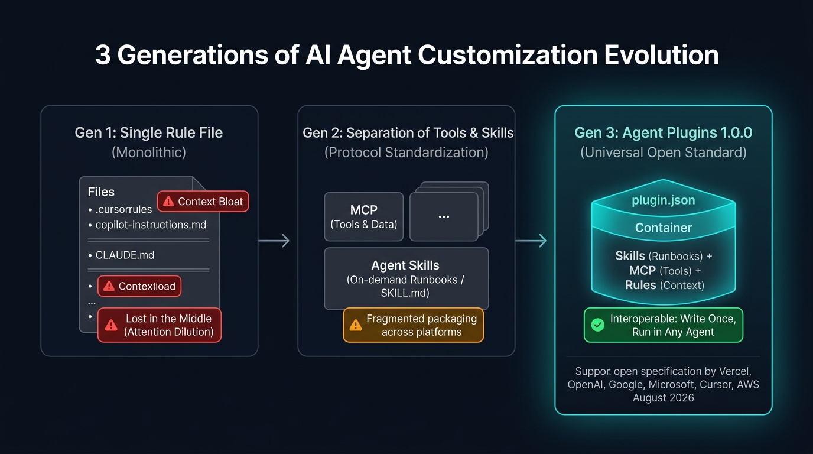

AI コーディングエージェント（Antigravity、Cursor、GitHub Copilot、Claude Code、ChatGPT/Codex 等）が急速に普及する中で、開発者が直面していた最大の課題は **「エージェント拡張機能の分断（Fragmentation）」** でした。

ツールごとに設定ファイルの配置や形式が異なり、同じ手順書や外部ツール連携をエージェントごとに個別に書き直す必要があったのです。

この問題を解決するため、**2026 年 8 月 6 日、Vercel、OpenAI、Google、Microsoft、Anysphere（Cursor）、Amazon（AWS）らが共同で策定したオープン標準規格が「Agent Plugins 1.0.0」** です。

本記事では、単一プロンプトから始まったエージェント拡張の歴史、Agent Plugins がオープン規格として標準化された背景、そして Skills（手順書）と MCP（外部ツール接続）を束ねるパッケージングアーキテクチャを解説します。

---

## エージェント拡張の歴史と「オープン標準」への進化

エージェントのカスタマイズ手法は、単一ファイルのプロンプトから業界横断のオープン標準規格へと進化してきました。



### 第 1 世代：単一指示ファイル時代（Prompt in Repo）
- **代表例**: `.cursorrules`、`copilot-instructions.md`、初期の `CLAUDE.md`
- **特徴**: リポジトリ直下の Markdown に規約・手順・API 仕様をすべて列挙する。
- **課題**:
  - **Context Bloat（トークン浪費）**: 毎ターン大量のテキストが無条件でコンテキストに注入され、レイテンシと API コストが急増。
  - **Attention Dilution（指示の希釈）**: スタンフォード大等の研究 **[『Lost in the Middle』(Liu et al., 2023)](https://arxiv.org/abs/2307.03172)** の通り、プロンプトが長大化するほど重要ルールの遵守率が低下。

### 第 2 世代：MCP と Skills の登場（部分的な標準化とフォーマットの分断）
- **MCP（Model Context Protocol）の登場**: 2024 年秋に Anthropic がオープンソース化。外部 API や DB とのツール接続が JSON-RPC 2.0 ベースで標準化。
- **Agent Skills の登場**: タスク手順書（Runbook）を `SKILL.md` として切り出し、必要な時だけオンデマンドで読み込む「段階的開示（Progressive Disclosure）」が標準化（agentskills.io）。
- **直面した新たな壁（エコシステムの分断）**:
  - ツール接続（MCP）と手順書（Skills）という 2 つのオープン標準が揃ったものの、**それらを「1 つの配布可能な拡張機能」としてまとめるパッケージ形式が各社でバラバラ** でした。
  - Cursor 用のプラグイン、Copilot 用のプラグイン、Antigravity 用のプラグインを別々にメンテしなければならず、開発者の負担が限界に達していました。

### 第 3 世代：Agent Plugins 1.0.0 オープン標準の成立（2026 年 8 月）
- **発起・共同策定**:
  - **Vercel** が主導し、**OpenAI**、**Google**（Core Maintainer）、**Microsoft**、**Anysphere（Cursor）**、**Amazon（AWS）** が技術運営委員会（TSC: Technical Steering Committee）を結成。
- **目的**:
  - **「Write once, run in any agent（一度書けば、どの AI エージェントでもそのまま動く）」**
  - プラットフォーム固有の独自仕様を排し、最小限の相互運用基盤（Interoperability Floor）として標準化。
- **対応クライアント**:
  - ChatGPT / Codex、Cursor、GitHub Copilot、Google Antigravity、VS Code、Kiro など主要エージェントが一斉に対応。

---

## 3 つの標準規格の関係性

Agent Plugins はゼロから作られたものではなく、**先行する 2 つのオープン標準を包括する「外側のコンテナ（パッケージング層）」** として位置づけられています。

```text
+-----------------------------------------------------------------------+
|  Agent Plugins 1.0.0 (オープン標準パッケージング層 / plugin.json)        |
|                                                                       |
|   +---------------------------------+   +-------------------------+   |
|   |  Agent Skills (agentskills.io)  |   |  MCP (Anthropic/Open)   |   |
|   |  ・オンデマンド手順書 (Runbook)   |   |  ・外部ツール / API 接続  |   |
|   |  ・SKILL.md / Progressive       |   |  ・mcp.json / Stdio/SSE |   |
|   +---------------------------------+   +-------------------------+   |
|                                                                       |
|   +---------------------------------------------------------------+   |
|   |  Rules / Context (規約・スコープ制御 / AGENTS.md)                |   |
|   +---------------------------------------------------------------+   |
+-----------------------------------------------------------------------+
```

1. **MCP (Model Context Protocol)**: エージェントが外部世界（DB、GitHub、クラウド）と対話するための **「手足（ツール接続）」**。
2. **Agent Skills (agentskills.io)**: エージェントがタスクをどう進めるべきかを教える **「脳のノウハウ（手順書・Runbook）」**。
3. **Agent Plugins (標準仕様)**: 上記のツールと手順書、および適用ルールを 1 つのディレクトリに束ねる **「パッケージ（配布単位）」**。

---

## Agent Plugins のディレクトリ構造とマニフェスト仕様

Agent Plugins 1.0.0 では、相互運用性を保証するために明確なディレクトリレイアウトとマニフェスト（`plugin.json`）が定義されています。

```text
plugins/<plugin_name>/
├── plugin.json       # 【必須】プラグインマニフェスト
├── skills/           # 【標準】Agent Skills 規格準拠の手順書ディレクトリ
│   └── <skill_name>/
│       ├── SKILL.md
│       ├── scripts/
│       └── references/
├── mcp.json          # 【標準】MCP サーバー定義（mcp_config.json）
├── rules/            # 【標準】プラグイン有効時に適用される規約（AGENTS.md）
│   └── AGENTS.md
└── hooks.json        # 【オプショナル】ライフサイクルフック（Antigravity等でサポート）
```

### `plugin.json` の仕様

プラグインのルートに配置するマニフェストファイルです。エージェント間の互換性を保つため、スキーマ定義に基づいた厳格なメタデータが記述されます。

```json
{
  "$schema": "https://agentplugins.io/schemas/v1/plugin.json",
  "name": "devops-toolkit",
  "description": "インフラデプロイ手順、DBマイグレーション、および Cloud MCP 連携を提供するプラグイン",
  "version": "1.0.0",
  "disabled": false
}
```

- **`$schema`**: 公式の Agent Plugins JSON スキーマ URI
- **`name`**: プラグインの一意な識別名
- **`description`**: エージェントがプラグインの目的を理解するための自然言語テキスト
- **`version`**: セマンティックバージョニング（SemVer）に準拠したバージョン表記

---

## コア構成要素 ①：Agent Skills（段階的開示）

**Agent Skills 規格（agentskills.io）** に準拠した手順書（Runbook）です。

エージェント起動時は `SKILL.md` のフロントマター（`name` と `description`）のみを読み込み、ユーザーの指示が合致した瞬間だけ本文がコンテキストへ注入される **「Progressive Disclosure（段階的開示）」** により、トークン消費を抑えます。

```markdown
---
name: db-migration
description: データベースの新規マイグレーション作成、適用、および整合性チェックを行う際に使用する。
---

# Database Migration Procedure

## 前提条件
- Docker コンテナでローカル DB が起動していること。

## 実行手順
1. `./scripts/validate.sh` を実行して接続を確認する。
2. `npm run migrate:up` を実行する。
3. `npm run test:db` で整合性を確認する。
4. エラーが発生した場合は `npm run migrate:down` でロールバックする。
```

---

## コア構成要素 ②：Model Context Protocol（MCP ツール連携）

プラグイン内の `mcp.json`（または `mcp_config.json`）で宣言された MCP サーバーは、プラグインが有効化された際にクライアントによって自動起動・接続されます。

```json
{
  "mcpServers": {
    "github": {
      "command": "npx",
      "args": ["-y", "@modelcontextprotocol/server-github"],
      "env": {
        "GITHUB_PERSONAL_ACCESS_TOKEN": "${env:GITHUB_TOKEN}"
      }
    },
    "db-inspect": {
      "command": "uvx",
      "args": ["mcp-server-sqlite", "--db-path", "./data/dev.db"]
    }
  }
}
```

> [!WARNING]
> **環境変数によるシークレット管理**
> トークンやパスワードは決して直接記述せず、必ず `${env:VAR_NAME}` 形式でクライアントの環境変数から動的に注入します。

---

## コア構成要素 ③：Rules（スコープ付き規約）

プラグイン配下の `rules/AGENTS.md` に定義されたコーディング規約は、**そのプラグインがアクティブなセッションでのみ有効化** されます。

グローバルの `AGENTS.md` に不要なインフラ固有ルールやライブラリ規約を常時ロードさせることなく、特定タスクのコンテキストでのみ必要な制約をピンポイントで課すことができます。

---

## プラグインの配布・共有モデル

オープン規格となったことで、プラグインはあらゆる形態でポータブルに共有可能です。

1. **プロジェクト内配置（リポジトリ共有）**: `.agents/plugins/<plugin-name>/` に配置してチームで Git 共有。
2. **外部リポジトリ参照（エコシステム共有）**: `.agents/plugins.json` を通じて、社内共有ライブラリや OSS プラグインを参照。
3. **グローバル配置（個人環境）**: `~/.gemini/config/plugins/` などに配置して全プロジェクトで使い回し。

---

## 実践例：チーム共通の「リリース自動化プラグイン」

オープン標準の Agent Plugins を使えば、Rules（規約）、Skills（手順）、MCP（ツール）が 1 まとまりになった再利用可能なモジュールを簡単に構築できます。

```text
plugins/release-toolkit/
├── plugin.json
├── rules/
│   └── AGENTS.md         # 【Rules】SemVer 遵守・コミット規約の強制
├── skills/
│   └── prepare-release/
│       ├── SKILL.md      # 【Skills】リリース前テスト・CHANGELOG 生成手順
│       └── scripts/
│           └── check-diff.sh
└── mcp.json              # 【MCP】GitHub MCP（PR 作成・タグ打ちツール）
```

- **Rules**: SemVer 以外のバージョン採番や規約違反コミットを禁止する枠組みを提供。
- **Skills**: リリース前チェック手順書をオンデマンドで展開し、差分スクリプトを実行。
- **MCP**: GitHub MCP ツールを自動呼び出ししてリリース PR を発行。

---

## まとめ

Agent Plugins 1.0.0 は、プロプライエタリな独自機能の乱立から、**業界横断のオープン標準（Open Specification）への進化** を象徴する規格です。

- **誕生の必然**: 単一プロンプト（第1世代）➔ MCP/Skills 分散（第2世代）➔ **オープン標準パッケージ化（第3世代）**
- **強固なアライアンス**: Vercel、OpenAI、Google、Microsoft、Cursor、AWS らが共同策定したベンダー中立仕様
- **3 つのオープン標準の統合**: 「MCP（手足）」＋「Skills（手順）」＋「Rules（規約）」を「Plugins（外側のコンテナ）」に集約

これにより、一度プラグインを作成すれば、Antigravity、Cursor、Copilot、ChatGPT などクライアントを選ばずに同一の高度なエージェントワークフローを展開できるようになりました。


