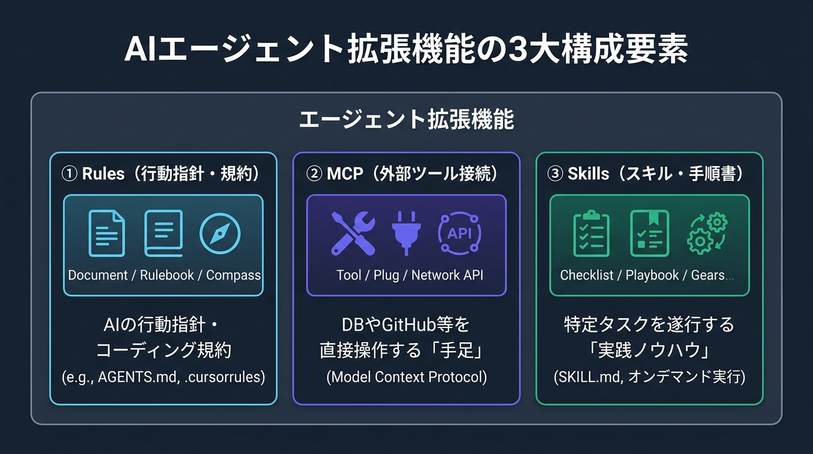
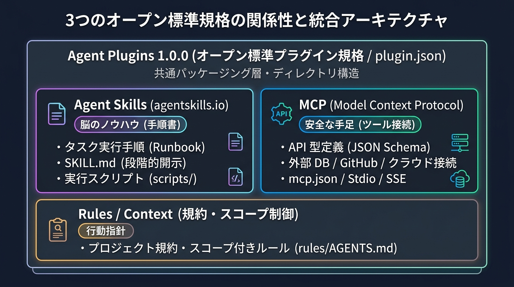

## はじめに

AI コーディングエージェント（Antigravity、Cursor、GitHub Copilot、Claude Code 等）が急速に普及する中で、開発者が直面していた最大の課題は **「エージェント拡張機能の分断（Fragmentation）」** でした。

> [!INFO] エージェント拡張機能（Agent Extensions）とは？
> AI コーディングエージェントに対して、**「新しい機能（外部ツール連携）」や「専門知識・実行能力（スキル）」を後から追加・カスタマイズする仕組み全般**を指します。

エージェント拡張機能は、主に以下の 3 つの要素で構成されています。



1. **Rules（行動指針・規約）**
   - **役割**: 「このプロジェクトではこの方針・コーディング規約に従って」という指示。
   - **代表例**: `AGENTS.md`、`.cursorrules`、`CLAUDE.md` など。
2. **MCP（Model Context Protocol / 外部ツール接続）**
   - **役割**: AI が外部のデータベース、GitHub、API、クラウド環境等と直接やり取りするための **「手足（ツール接続）」**。
   - **代表例**: GitHub MCP サーバー、PostgreSQL MCP サーバーなど。
3. **Agent Skills（スキル / タスク実行ノウハウ）**
   - **役割**: 特定のタスク（ビルド検証、テスト実行、マイグレーション等）を確実に実行するための **「手順書（`SKILL.md`）と実行スクリプト（`scripts/`）」**。
   - **代表例**: `SKILL.md`（[agentskills.io](https://agentskills.io) 規格）。

> [!INFO] Agent Skills（スキル）とは？
> AI エージェントに特定のタスク（ビルド検証、テスト実行、マイグレーション等）を確実に実行させるための **「手順書（`SKILL.md`）と実行用スクリプト（`scripts/`）をまとめた専用フォルダ」** です。
> 
> AI は手順書に従い、同梱されたスクリプトを自律的に呼び出して作業を行います。また、**必要な時だけオンデマンドで読み込む（段階的開示）** 仕組みのため、無駄なトークン消費を防ぎながら安全・確実にタスクを遂行できます。

従来はエージェント製品（クライアント）ごとに設定ファイルの配置場所や記述形式が異なるため、同じスキルや外部ツール連携を、Cursor 用、Copilot 用、Claude Code 用…と個別に書き直す必要がありました。

この問題を解決するため、**2026 年 8 月 6 日、Vercel、OpenAI、Google、Microsoft、Anysphere（Cursor）、Amazon（AWS）らが共同で策定したオープン標準規格が「Agent Plugins 1.0.0」** です。

> [!INFO] Agent Plugins とは？
> Rules（規約）、MCP（ツール接続）、Skills（スキル）を **1 つのディレクトリにまとめて配布・利用できるようにした「エージェント向けプラグイン（拡張機能）」** です。
> 
> 2026 年 8 月に策定された共通規格（1.0.0）に準拠することで、「Write once, run in any agent（一度作れば、どの AI エージェントでもそのまま動く）」という高いポータビリティを実現します。

本記事では、単一プロンプトから始まったエージェント拡張の歴史、Agent Plugins がオープン規格として標準化された背景、そして Skills（スキル）と MCP（外部ツール接続）を統合するプラグインの仕組みとディレクトリ構造を解説します。

---

## エージェント拡張の歴史と「オープン標準」への進化

エージェントのカスタマイズ手法は、チャットプロンプトによる手動指示（前史）から単一ファイルのルール、そして業界横断のオープン標準規格へと進化してきました。


### 前史：チャットプロンプト時代（Prompt in Chat）
- **特徴**: リポジトリに設定ファイルを置く仕組みがなく、毎回チャット欄の冒頭にコーディング規約や手順を手動でペーストしていた時代。
- **課題（会話履歴要約による指示の消滅）**:
  - 会話が 10〜20 ターンと進むと、コンテキスト上限に達したエージェントが過去の会話履歴を自動要約・圧縮（Compact）します。
  - その際、**「最初にプロンプトで伝えたはずの規約や前提条件」が要約によって削ぎ落とされ（Lossy Compression）、指示が効かなくなる** という問題が生じていました。

### 第 1 世代：単一指示ファイル時代と AGENTS.md の登場（Prompt in Repo）
- **誕生の背景**: 前史の「要約で指示が消える」問題を回避するため、「リポジトリ内に指示ファイルを置き、毎ターンのプロンプト（システムコンテキスト）に自動で丸ごと結合して LLM へ送信する」仕組みが生まれました。
- **初期の混乱と共通化（AGENTS.md）**:
  - 当初はエージェントごとに `.cursorrules`、`copilot-instructions.md`、`CLAUDE.md` と設定ファイルが乱立していました。
  - この分断を解消するため、業界横断の共通仕様としてリポジトリ直下の **`AGENTS.md` への標準化** が進み、多くのクライアント（Antigravity、Cursor、Copilot 等）がこれを共通ルールとして読み込むようになりました。
- **直面した「単一ファイル方式」の実用上の課題**:
  - ファイル名の統一には成功したものの、**「1 つのファイルに規約・手順・API 仕様をすべて列挙するアーキテクチャ」そのものが持つ構造的な課題** が浮き彫りになりました。
  - **Context Bloat（プロンプト肥大化とコスト増）**:
    - 常時ロードされる指示ファイル（固定費）に加えて、作業が進むにつれて会話履歴や読み込んだコード（変動費）が蓄積され、プロンプト全体が膨らんでコンテキスト上限を圧迫し、レイテンシが悪化する。
  - **Attention Dilution（注意の希釈と「中央ゾーンの指示無視」）**:
    - *Dilution*（希釈・薄まり）。プロンプトは「① 文頭のシステム指示」「② 中盤の指示ファイルと会話履歴」「③ 文末の最新ユーザー入力」というサンドイッチ構造で LLM に送られます。
    - スタンフォード大等の研究 **[『Lost in the Middle』(Liu et al., 2023)](https://arxiv.org/abs/2307.03172)** が実証した通り、LLM は文頭と文末には強い注意（Attention）を払いますが、**中央付近に位置するテキストへの Attention は著しく低下（U 字型カーブの谷底）** します。
    - 指示ファイルが長大化したり会話履歴が伸びるほど、ファイル中盤に書かれた重要ルール（「テストを必ず書く」「特定記法を避ける」等）が中央のブラックホールゾーンに沈み込み、AI が指示を見落とす原因になっていました。

### 第 2 世代：機能パーツごとの標準化（MCP と Skills）とパッケージの分断
- **MCP（Model Context Protocol）による「手足（ツール接続）」の厳格な制御**:
  - スキルのような「自由なシェル・ターミナル実行」は自由度が高すぎる反面、AI が勝手なコマンドを叩くなど制御が難しいリスクがありました。
  - 2024 年秋に Anthropic がオープンソース化した **MCP** は、**「API で提供される、あらかじめ決められた正しい形式の安全な機能のみを呼び出す」** 仕組みに制限することで、確実で安全なツール制御を標準化しました。
- **Agent Skills による「脳のノウハウ（手順）」の標準化（指示ファイルのスリム化 ＋ 段階的開示）**:
  - **指示ファイルのスリム化**: 常時ロードする指示ファイル（`AGENTS.md` 等）には最小限の方針・規約と「どんなスキルがあるか」という目次（インデックス）のみを置き、プロンプトを常に軽量・高アテンションに保つ。
  - **段階的開示（Progressive Disclosure）**: 各作業の詳細手順や実行スクリプトは `skills/<name>/` フォルダに独立させ、**AI が「この作業が必要だ」と判断した瞬間だけノーカットの原本をオンデマンドで読み込む**。要約（情報の欠落）に頼らず、完全な手順をロスレスで実行できる仕組みを確立（[agentskills.io](https://agentskills.io) 規格）。
- **直面した新たな壁（パッケージ形式の分断）**:
  - ツール接続（MCP）と手順書（Skills）という個別パーツは揃ったものの、**それらを 1 つに束ねて配布・インストールするための「共通パッケージ規格」が存在せず、各エージェント（Cursor、Copilot、Antigravity 等）で設定やフォルダ構造がバラバラ** でした。
  - 同じ拡張機能であってもツールごとに別々のフォーマットで設定・保守する必要があり、チーム内での共有や運用の摩擦となっていました。

### 第 3 世代：Agent Plugins 1.0.0 オープン標準の成立（2026 年 8 月）
- **発起・共同策定**:
  - **Vercel** が主導し、**OpenAI**、**Google**（Core Maintainer）、**Microsoft**、**Anysphere（Cursor）**、**Amazon（AWS）** が技術運営委員会（TSC: Technical Steering Committee）を結成。
- **目的**:
  - **「Write once, run in any agent（一度書けば、どの AI エージェントでもそのまま動く）」**
  - プラットフォーム固有の独自仕様を排し、Rules（規約）、MCP（ツール接続）、Skills（スキル）を 1 つの統一ディレクトリ構造（`plugin.json`）で管理・配布できるように標準化。
- **対応状況とエコシステム**:
  - **統合パッケージ直接対応**: Cursor、VS Code（GitHub Copilot / 各種 Agent 拡張）、Google Antigravity、ChatGPT / Codex、Kiro など TSC 参加企業や賛同クライアントを中心に共通化が進展。
  - **個別パーツでの互換性**: Claude Code や Aider などの独自 CLI は、統合プラグイン（`plugin.json`）の直接ロードではなく、自社のディレクトリ構造（`CLAUDE.md` や `.claude/mcp.json`）を通じて MCP やルールを個別に配置・利用する設計を維持しています。

---

## 3 つの標準規格の関係性

Agent Plugins はゼロから作られたものではなく、**先行して普及していた 2 つのオープン標準「MCP」と「Agent Skills」を包括する「共通プラグイン規格」** として位置づけられています。



1. **[MCP (Model Context Protocol)](https://modelcontextprotocol.io)**:
   - Anthropic が 2024 年秋に策定したオープン規格。エージェントが外部世界（DB、GitHub、クラウド）と安全にやり取りするための **「手足（ツール・API 接続）」** を提供します。
2. **[Agent Skills (agentskills.io)](https://agentskills.io)**:
   - 2025 年から広まった手順書規格。エージェントが特定タスクを確実に遂行するための **「脳のノウハウ（手順書 `SKILL.md` と実行スクリプト `scripts/`）」** を提供します。
3. **[Agent Plugins (agent-plugins.org)](https://agent-plugins.org)**:
   - 2026 年 8 月に策定された統合規格。上記 2 つの先行規格（MCP と Skills）および Rules を 1 つのディレクトリに束ね、どのエージェントでもそのまま動くようにする **「共通プラグイン（配布・利用単位）」** です。

---

## Agent Plugins のディレクトリ構造とマニフェスト仕様

Agent Plugins 1.0.0 では、相互運用性を保証するために明確なディレクトリレイアウトとマニフェスト（`plugin.json`）が定義されています。

```text
plugins/<plugin_name>/
├── plugin.json       # 【必須】プラグインの定義・名札（必須マニフェスト）
├── skills/           # 【任意】手順書を含める場合に配置（Agent Skills 規格）
│   └── <skill_name>/
│       ├── SKILL.md  # 【必須】スキルの手順書（フロントマター ＋ 本文）
│       └── scripts/  # 【任意】自動化スクリプトを含める場合に配置
└── mcp.json          # 【任意】外部ツール・API 連携を含める場合に配置
```

### `plugin.json` の仕様

> [!INFO] マニフェスト（Manifest / plugin.json）とは？
> ソフトウェアやプラグインの **「名札・基本プロフィール（メタデータ）を記した定義ファイル」** のことです。
> 
> Node.js における `package.json` や、Chrome 拡張機能の `manifest.json` と同じ役割を果たします。エージェントはまずこのファイルを読むことで、「このプラグインの名前は何か」「どんな目的で作られたのか」「どのバージョンか」を一目で認識し、安全にロードします。

プラグインのルートに配置するマニフェストファイルです。エージェント間の互換性を保つため、スキーマ定義に基づいた厳格なメタデータが記述されます。

```json
{
  "$schema": "https://agentplugins.io/schemas/v1/plugin.json",
  "name": "devops-toolkit",
  "description": "インフラデプロイ手順、DBマイグレーション、および Cloud MCP 連携を提供するプラグイン",
  "version": "1.0.0",
  "disabled": false
}
```

> [!INFO] JSON スキーマ（`$schema`）とは？
> JSON ファイルに **「必須項目やデータ型のルールブック（設計図）」を適用するための仕組み** です。
> 
> VS Code や Cursor 等のモダンなエディタにはスキーマエンジンが標準内蔵されているため、**特別なプラグインの追加や事前設定は一切不要** です。冒頭に `"$schema": "https://..."` と 1 行記述しておくだけで、エディタが自動でネットからルールブックを読み込み、誰の PC 環境でも即座に以下の支援が有効になります。
> 
> 1. **エディタの入力補完**: `Ctrl + Space` で、次に書くべきキー（`description` や `version` 等）が自動でサジェストされます。
> 2. **タイポ（スペルミス）の即時検知**: キー名を打ち間違えたり、必須項目を書き忘れた場合にエディタが赤波線で警告してくれます。
> 3. **エージェントによる整合性検証**: AI エージェントがプラグインを読み込む際、壊れた不正な設定ファイルを自動で検知・除外できます。

- **`$schema`**: 公式の Agent Plugins JSON スキーマ URI（エディタでの入力補完やバリデーションを有効化）
- **`name`**: プラグインの一意な識別名
- **`description`**: エージェントがプラグインの目的を理解するための自然言語テキスト
- **`version`**: セマンティックバージョニング（SemVer）に準拠したバージョン表記

---

## コア構成要素 ①：Agent Skills（手順書と実行スクリプト）

**Agent Skills 規格（[agentskills.io](https://agentskills.io)）** に準拠した手順書（Runbook）です。

エージェント起動時は `SKILL.md` のフロントマター（`name` と `description`）のみを読み込み、ユーザーの指示が合致した瞬間だけ本文がコンテキストへ注入される **「Progressive Disclosure（段階的開示）」** により、トークン消費を抑えながら確実な手順実行を実現します。

```markdown
---
name: db-migration
description: データベースの新規マイグレーション作成、適用、および整合性チェックを行う際に使用する。
---

# Database Migration Procedure

## 前提条件
- Docker コンテナでローカル DB が起動していること。

## 実行手順
1. `./scripts/validate.sh` を実行して接続を確認する。
2. `npm run migrate:up` を実行する。
3. `npm run test:db` で整合性を確認する。
4. エラーが発生した場合は `npm run migrate:down` でロールバックする。
```

---

## コア構成要素 ②：MCP（外部ツール・API 接続）

MCP は、自由すぎるシェル実行による暴走やミスを防ぎ、**「API で提供される、あらかじめ許可された特定の機能のみ」を決められた正しい形式で安全に呼び出せるようにした** ツール接続規格です。

プラグイン内の `mcp.json`（または `mcp_config.json`）で宣言された MCP サーバーは、プラグインが有効化された際にクライアントによって自動起動・接続されます。

```json
{
  "mcpServers": {
    "github": {
      "command": "npx",
      "args": ["-y", "@modelcontextprotocol/server-github"],
      "env": {
        "GITHUB_PERSONAL_ACCESS_TOKEN": "${env:GITHUB_TOKEN}"
      }
    },
    "db-inspect": {
      "command": "uvx",
      "args": ["mcp-server-sqlite", "--db-path", "./data/dev.db"]
    }
  }
}
```

> [!WARNING] 環境変数によるシークレット管理
> プラグインを Git でチーム共有したり外部配布した際に **API キーや機密情報の漏洩を防ぐため**、トークンやパスワードは設定ファイルに直接記述せず、必ず `${env:VAR_NAME}` 形式で各ユーザーの実行環境から動的に注入します。

---

## プラグインの配置と共有モデル

Agent Plugins 1.0.0 は「プラグイン内部のフォーマット」を統一する**相互運用性の最低基準（Interoperability Floor：互換性を保つための共通の土台）** であり、**配置場所やインストール・管理方法は各エージェント（クライアント）の仕様** に委ねられています。

主な配置・共有の形態：
- **リポジトリ内共有**: 各エージェントがサポートするプロジェクト内ディレクトリに配置し、Git でチームメンバーと共有。
  - 例: **`.agents/plugins/<name>/`**（Antigravity、Cursor、Copilot 等で共通してサポートされるデファクト配置）
  - 例: **`.gemini/plugins/<name>/`**（Antigravity 固有）、**`.vscode/plugins/<name>/`**（VS Code / Copilot 固有）
- **個人環境でのグローバル利用**: 各ツールのグローバル設定ディレクトリ（例: `~/.gemini/antigravity-cli/plugins/` など）に配置し、全プロジェクトで共通して利用。
- **外部配布**: Git リポジトリや将来的なパッケージレジストリを通じた OSS プラグインの共有。

---

## 実践例：チーム共通の「リリース自動化プラグイン」

オープン標準の Agent Plugins を使えば、Skills（手順・スクリプト）と MCP（外部ツール接続）が 1 まとまりになった再利用可能な拡張機能をシンプルに構築できます。

```text
plugins/release-toolkit/
├── plugin.json           # プラグイン定義（バージョン・説明）
├── skills/
│   └── prepare-release/
│       ├── SKILL.md      # リリース前テスト・CHANGELOG 生成手順
│       └── scripts/
│           └── check-diff.sh
└── mcp.json              # GitHub MCP（PR 作成・タグ打ちツール）
```

#### 1. プラグイン定義 (`plugin.json`)
```json
{
  "$schema": "https://agentplugins.io/schemas/v1/plugin.json",
  "name": "release-toolkit",
  "description": "バージョン検証、CHANGELOG 生成、および GitHub リリース PR 発行を自動化するプラグイン",
  "version": "1.0.0"
}
```

#### 2. リリース手順書 (`skills/prepare-release/SKILL.md`)
```markdown
---
name: prepare-release
description: リリース前の差分検証、テスト実行、CHANGELOG 更新を行い、リリース PR を準備する際に使用する。
---

# Release Preparation Procedure

## 実行手順
1. `./scripts/check-diff.sh` を実行し、未コミットの差分や型エラーがないか検証する。
2. `npm test` を実行して全テストが通過することを確認する。
3. 前回タグからのコミットログを抽出し、`CHANGELOG.md` を更新する。
4. GitHub MCP の `create_pull_request` ツールを呼び出し、「Release vX.Y.Z」の PR を作成する。
```

#### 3. 実行スクリプト (`skills/prepare-release/scripts/check-diff.sh`)
```bash
#!/usr/bin/env bash
set -euo pipefail

echo "=== リリース前検証を開始 ==="

# 1. 未コミット差分の確認
if [ -n "$(git status --porcelain)" ]; then
  echo "Error: 作業ツリーに未コミットの変更が存在します。" >&2
  exit 1
fi

# 2. 型チェックの実行
echo "TypeScript 型チェック中..."
npm run typecheck

echo "✓ 検証完了: リリース準備が可能です。"
```

#### 4. 外部ツール接続 (`mcp.json`)
```json
{
  "mcpServers": {
    "github": {
      "command": "npx",
      "args": ["-y", "@modelcontextprotocol/server-github"],
      "env": {
        "GITHUB_PERSONAL_ACCESS_TOKEN": "${env:GITHUB_TOKEN}"
      }
    }
  }
}
```

- **Skills**: リリース前チェック手順書をオンデマンドで展開し、差分確認スクリプトを実行。
- **MCP**: GitHub MCP ツールを安全に呼び出してリリース PR を発行。

---

## Agent Plugins の今後の展望

バージョン 1.0.0 の策定によって「共通のディレクトリ構造」という最低限の土台（Interoperability Floor）が確立されました。今後は以下のような領域でのエコシステムの発展が期待されています。

1. **パッケージレジストリと導入の自動化**:
   - 現在は Git リポジトリやローカルディレクトリでの配置が中心ですが、今後は npm や Homebrew のように `agent install <plugin-name>` といったコマンドで即座にプラグインを導入・更新できる公式レジストリの整備が進む見込みです。
2. **セキュリティと実行パーミッションの標準化**:
   - プラグインに同梱されたスクリプトや MCP ツールがホスト環境を安全に操作できるよう、サンドボックス実行やアクセス権限（パーミッション承認）の共通モデル策定が議論されています。
3. **エコシステム全体の相互運用性の深化**:
   - 現在は独自ディレクトリ構成をとっている CLI ツールやチャットプラットフォームも含め、業界全体でのプラグイン互換性のさらなる拡大が見込まれます。

---

## まとめ

Agent Plugins 1.0.0 は、独自機能の乱立から、**業界横断のオープン標準（Open Specification）への進化** を象徴する規格です。

- **誕生の必然**: チャットプロンプト（前史）➔ 単一指示ファイル（第1世代）➔ MCP/Skills による機能分離（第2世代）➔ **共通プラグイン規格（第3世代）**
- **主要各社による共同策定**: Vercel、OpenAI、Google、Microsoft、Cursor、AWS らが手を組み、ベンダー中立なオープン仕様として標準化
- **2 大オープン標準の統合**: 「MCP（安全なツール接続）」＋「Skills（オンデマンド手順書）」を 1 つの統一ディレクトリに集約

これにより、一度プラグインを作成すれば、Cursor、VS Code、Google Antigravity、ChatGPT など対応クライアントを選ばずに同一の高度なエージェントワークフローを展開できるようになりました。

> ※ 本記事の構成検討・Web 検索による事実検証・Hugo によるビルド検証・推敲も、Antigravity CLI との自律協働ループによって執筆・検証されています。

---

## 参考リンク・情報ソース

### 公式仕様・規格ハブ
- [Agent Plugins: The Open Packaging Standard (agent-plugins.org)](https://agent-plugins.org)
- [Model Context Protocol: Open Standard for AI Tools (modelcontextprotocol.io)](https://modelcontextprotocol.io)
- [Agent Skills: Open Runbook Specification (agentskills.io)](https://agentskills.io)

### 学術論文（コンテキスト特性・Attention 希釈）
- [Lost in the Middle: How Language Models Use Long Contexts (Liu et al., 2023 / Stanford University, UC Berkeley)](https://arxiv.org/abs/2307.03172)
