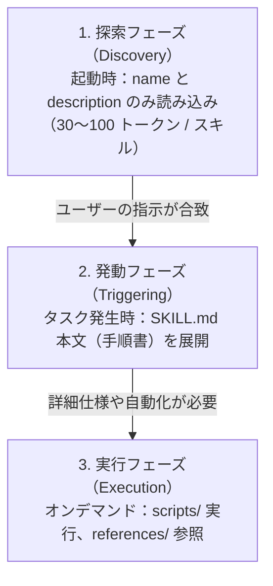

> [!NOTE] 個人用メモ・備忘録
> 日々の開発・インフラ検証の備忘録として残している個人ノートです。手元環境での動作ログをもとにまとめています。環境差異等もあるため、参考にされる場合はご自身の環境で検証の上ご活用ください。

## はじめに

AI コーディングエージェントにデプロイ手順、データベースマイグレーション、障害調査などの定型タスクを実行させる際、すべての詳細手順を `AGENTS.md` などのルールファイルに記述すると、プロンプトが肥大化して **Context Bloat（トークン消費の増大）** や **Attention Dilution（重要指示の埋没・見落とし）** が発生します。

この問題を解決し、専門手順や実行コードをオンデマンドで読み込むオープン標準規格が **Agent Skills（[agentskills.io](https://agentskills.io)）** です。

本記事では、`agentskills.io` の公式仕様、中核となる **段階的開示（Progressive Disclosure）** のアーキテクチャ、標準ディレクトリ構造、およびトークン効率と決定論的実行を両立する設計原則をまとめます。

---

## 段階的開示（Progressive Disclosure）のアーキテクチャ

Agent Skills の最大の特徴は、**「必要な情報だけを、必要なタイミングで読み込む」** という 3 段階のライフサイクル設計にあります。



### 1. 探索フェーズ（Discovery Phase）
エージェント起動時、インストールされている全スキルの `SKILL.md` から **YAML フロントマター（`name` と `description`）のみ** をインデックスとしてメモリに読み込みます。
1 スキルあたりわずか 30〜100 トークン程度しか消費しないため、数十〜数百個のスキルが存在してもコンテキスト上限を圧迫しません。

### 2. 発動フェーズ（Triggering Phase）
ユーザーのプロンプトを評価し、「このタスクにはあのスキルが必要だ」とエージェントが判断した瞬間に、該当する `SKILL.md` の **本文（Markdown 手順書）** をコンテキストに展開します。

### 3. 実行フェーズ（Execution Phase）
スキルの手順書に従って作業を進める中で、追加のドキュメントが必要になった場合は `references/` をピンポイントで参照し、自動化スクリプトが必要な場合は `scripts/` を実行します。

---

## Agent Skills の標準ディレクトリ構造

`agentskills.io` 仕様では、1 つのスキルを独立したフォルダとして構成します。

```text
my-specialized-skill/
├── SKILL.md          # 【必須 (Required)】メタデータ ＋ メイン手順書
├── scripts/          # 【任意 (Optional)】実行スクリプト（Python, Bash 等）
├── references/       # 【任意 (Optional)】詳細仕様書・スキーマ・参照資料
├── assets/           # 【任意 (Optional)】テンプレート・画像等の静的ファイル
└── evals/            # 【任意 (Optional)】スキルの動作検証用テストシナリオ
```

### 各サブディレクトリの役割

#### `SKILL.md`（必須）
スキルのエントリポイントです。YAML フロントマターと Markdown 本文で構成され、作業の大まかな流れや判断基準を記述します。

#### `references/`（任意：参照ドキュメント）
`SKILL.md` にすべて書ききれない **詳細な API 仕様書、エラーコード対応表、データスキーマ定義** などを格納します。
- **メリット**: `SKILL.md` 自体をスリムに保ち、エージェントが「特定のエラーが発生したとき」「特定パラメータを調べるとき」だけ該当ファイルを読めるようにします。
- **記述例**: `SKILL.md` 内に `[エラー一覧](references/error_codes.md)` のように相対パスでリンクを記載します。

#### `scripts/`（任意：実行コード）
エージェントがシェルから直接実行できるスクリプト（Bash, Python, Node.js 等）を配置します。
- **メリット**: AI に複雑なワンライナーをアドホックに生成させるのではなく、テスト済みの決定論的なコードを実行させることで作業の再現性と安全性を担保します。

#### `assets/`（任意：静的アセット）
テンプレートファイル、設定の雛形、画像データなどを配置します。

#### `evals/`（任意：評価テスト）
スキルが想定通りに動作するかを検証するためのプロンプト例やテストケースを定義します。

---

## `SKILL.md` の仕様と記述例

### 1. YAML フロントマターの仕様

`SKILL.md` の先頭には、探索フェーズで使われるメタデータを YAML 形式で定義します。

| フィールド | 必須 / 任意 | 型 | 説明 |
| :--- | :--- | :--- | :--- |
| **`name`** | **必須** | `string` | スキルの一意な識別子（1〜64文字、小文字英数字・ハイフン） |
| **`description`** | **必須** | `string` | スキルの役割と **発動条件（トリガー）** を自然言語で記載（最大 1024 文字） |
| `license` | 任意 | `string` | ライセンス情報（MIT, Apache-2.0 等） |
| `compatibility` | 任意 | `string` | 動作要件や前提環境（例: `Linux/macOS with Docker`） |
| `metadata` | 任意 | `object` | 任意のカスタムキーバリューストア |

> [!IMPORTANT]
> **`description` はトリガーの精度を左右する**
> エージェントは `description` を読んでスキルの使用可否を判断します。「何をするか」だけでなく、「どんな状況・指示のときに使うべきか（Use this skill when...）」を明確に記述することが極めて重要です。

### 2. `SKILL.md` の実践例

```markdown
---
name: db-migration
description: データベースのマイグレーション作成、適用、ロールバック、整合性確認を行う際に使用する。
compatibility: Linux / macOS, Docker 環境必須
---

# Database Migration Procedure

## 前提条件
- ローカルの PostgreSQL コンテナが起動していること。
- 詳細なテーブル定義は [スキーマ仕様](references/schema.md) を参照。

## 実行手順

1. **接続と状態確認**:
   ```bash
   ./scripts/check_connection.sh
   ```
2. **マイグレーションの適用**:
   ```bash
   npm run migrate:up
   ```
3. **整合性検証**:
   - 適用後、以下のテストを実行してエラーが出ないことを確認する。
   ```bash
   npm run test:db
   ```
4. **ロールバック手順（エラー発生時）**:
   - テストが失敗した場合は直ちにロールバックを実行する。
   ```bash
   npm run migrate:down
   ```
   - 失敗時のエラーコード詳細は [トラブルシューティング](references/troubleshooting.md) を参照。
```

---

## Rules（`AGENTS.md`）と Skills の使い分け
 
エージェントのコンテキスト効率と動作精度を最大化するための役割分担です。

| 項目 | Rules (`AGENTS.md`) | Skills (`SKILL.md`) |
| :--- | :--- | :--- |
| **定義・役割** | プロジェクト全体の共通規約・制約・Guardrails | 特定タスクの手順定義・実行スクリプト・参照ドキュメント群 |
| **読み込みタイミング** | 毎ターンのプロンプトに常時注入 | タスク発生時（`description` が一致した際）のみオンデマンド展開 |
| **主な記述内容** | コーディング規約、禁止コマンド、全体アーキテクチャ | 実行コマンド手順、検証・ロールバックフロー、個別 API 仕様 |
| **トークン消費** | 常時消費（Context Bloat を防ぐため最小限に抑制） | 使用時のみ一時消費（タスク完了後は破棄可能） |

---

## Agent Plugins との関係性

**Agent Skills** と **Agent Plugins（1.0.0 共通規格）** は競合するものではなく、**包含関係** にあります。

- **Agent Skills（[agentskills.io](https://agentskills.io)）**:
  - 「1 つの手順書フォルダ」の単位規格（`SKILL.md`、`scripts/`、`references/`）。
- **Agent Plugins（[agentplugins.io](https://agentplugins.io)）**:
  - 複数の Agent Skills、MCP（外部ツール接続）、Rules（規約）を束ねて配布・インストール可能にする「統合パッケージ規格」。

Agent Plugins の仕様においても、スキルフォルダの内部構造は `agentskills.io` 規格がそのまま標準仕様として採用されています。

---

## スキル作成のベストプラクティス

1. **`SKILL.md` を短く保ち、詳細は `references/` へ逃がす**
   - `SKILL.md` に長文の API リファレンスを直書きせず、`references/` に個別ファイルとして分割する。
2. **決定論的なスクリプトは `scripts/` に置く**
   - 複雑な bash コマンドやデータ変換処理は、スクリプト化して同梱することで LLM の出力ブレを防ぐ。
3. **成功判定・ロールバック手順を必ず明記する**
   - コマンド実行後の成否判定基準（期待される出力文字列や終了コード）を記載し、自律的に完了判定を行えるようにする。
4. **テストケース（`evals/`）を整備してリグレッションを防ぐ**
   - スキルの発動条件（プロンプト例）と期待される出力シナリオを定義し、プロンプト変更やモデルアップデート時の精度劣化を防ぐ。

---

## まとめ

- **段階的開示（Progressive Disclosure）**: 探索時（メタデータのみ）➔ 発動時（本文展開）➔ 実行時（スクリプト・詳細仕様の参照）の 3 段階でトークン消費を最小化。
- **標準ディレクトリ構造**: `SKILL.md` を起点に `scripts/`、`references/`、`assets/`、`evals/` を整理し、ポータブルな運用手順書を構築。
- **エコシステムとの調和**: 常時規約（`AGENTS.md`）とタスク別手順（`Agent Skills`）を明確に分離し、統合パッケージ規格（`Agent Plugins`）とシームレスに連携。

> ※ 本記事の構成検討・技術仕様の検証・Hugo による静的ビルド検証・推敲は、AI コーディングエージェントとの自律協働ループによって執筆・検証されています。

---

## 参考リンク・情報ソース

- [Agent Skills 公式仕様 (agentskills.io)](https://agentskills.io)
- [Agent Plugins: The Open Packaging Standard (agent-plugins.org)](https://agent-plugins.org)
- [Lost in the Middle: How Language Models Use Long Contexts (Liu et al., 2023)](https://arxiv.org/abs/2307.03172)

