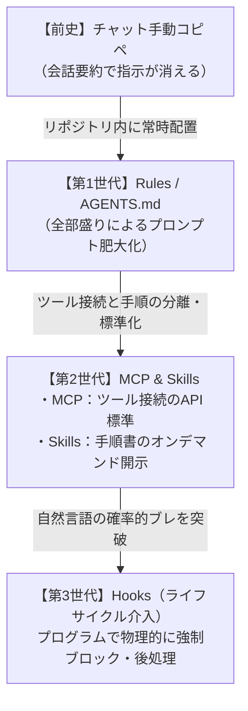

## はじめに

AI コーディングエージェント（Google Antigravity、Cursor、GitHub Copilot、Claude Code 等）を実務で活用する際、プロジェクト固有のアーキテクチャ、ビルド・テスト手順、コーディング規約をいかに正確にエージェントへ伝えるかが重要になります。

当初はツールごとに独自の設定ファイルが乱立していましたが、現在はオープン標準仕様としての **`AGENTS.md`** を中心に共通化が進んでいます。

本記事では、`AGENTS.md` が生まれた背景と Linux Foundation 傘下の標準化団体への移管の経緯、各ツール固有の指示ファイルとの仕様比較、そして実用的な書き方の設計原則を整理します。

---

## AGENTS.md の誕生とオープン標準化の経緯

`AGENTS.md` は、AI エージェントがリポジトリを自律的に理解して作業するための **「エージェントのための README（README for AI agents）」** として策定されたオープンな仕様です。

```
プロジェクトのルート / サブディレクトリ
├── README.md   # 人間（開発者）向けのオンボーディング・概要説明
└── AGENTS.md   # AI エージェント向けの機械可読な制約・実行コマンド・規約
```

### 1. 発祥：OpenAI による提唱（2025年8月）

2025 年 8 月、OpenAI が自社の Codex CLI 等に向けて提唱・導入したのが始まりです。

当時、AI ツールごとに設定ファイルが断片化しており、同じリポジトリであってもエディタやツールを切り替えるたびに別々の設定ファイルを保守する必要がありました。

- **Cursor**: `.cursorrules`
- **GitHub Copilot**: `.github/copilot-instructions.md`
- **Claude Code**: `CLAUDE.md`

この乱立を解消し、「ベンダーニュートラルで、どの AI ツールでも共通して読める単一の指示フォーマット」として考案されたのが `AGENTS.md` です。

### 2. Linux Foundation（AAIF）への移管（2025年12月）

2025 年 12 月 9 日、中立なオープンスタンダードとして普及させるため、OpenAI、Anthropic、Block、Google、Microsoft、AWS、Cloudflare 等が参画して **Linux Foundation** 傘下に **Agentic AI Foundation (AAIF)** が設立されました。

この設立に伴い、主要各社から中核プロジェクトが寄贈されました。

- **`AGENTS.md`（OpenAI より寄贈）**: エージェント向け共通指示フォーマット
- **`Model Context Protocol (MCP)`（Anthropic より寄贈）**: ツール・外部データ連携プロトコル
- **`goose`（Block より寄贈）**: ローカルファーストなオープンソース自律エージェント基盤

現在、`AGENTS.md` の仕様策定とガバナンスは特定の一企業ではなく、AAIF のコミュニティ主導で維持・管理されています（公式サイト：[agents.md](https://agents.md)）。

---

## 指示ファイル仕様の比較

主要な AI コーディングツールにおける指示ファイルの配置と読み込み仕様の比較です。

| ツール / 規格 | 設定ファイル | 配置場所 | 主な特徴とスコープ |
| :--- | :--- | :--- | :--- |
| **AGENTS.md**<br>*(オープン標準)* | `AGENTS.md` | ルート / 任意ディレクトリ | 階層遡り（Walk-up）走査に対応。プレーン GFM で記述し、複数ツールで共通利用可能 |
| **GitHub Copilot** | `copilot-instructions.md` | `.github/` | リポジトリ全体に適用。Chat、インライン提案、PR 要約等で参照 |
| **Cursor** | `.cursorrules`<br>`*.mdc` | ルート<br>`.cursor/rules/` | フロントマターで `globs` を指定し、対象ファイル拡張子やパスごとにルールを動的適用可能 |
| **Claude Code** | `CLAUDE.md` | ルート / サブディレクトリ | プロジェクトのビルド・テストコマンドやコード規約を自然言語で指定 |
| **Google Antigravity** | `AGENTS.md`<br>`GEMINI.md` | ルート / サブディレクトリ / `.agents/rules/` | `AGENTS.md` を標準サポート。Skills（手順書）や MCP（ツール接続）と分離して階層ロード |

> [!NOTE]
> 現在の多くのツール（Antigravity、Cursor、Codex 等）は `AGENTS.md` をネイティブに解釈します。一部ツール（Claude Code 等）で専用ファイルを要求される環境では、`AGENTS.md` へのシンボリックリンクを作成して二重管理を防ぐ運用も一般的です。

---

## 各ツールの設定フォーマット

### 1. AGENTS.md（オープン標準）

GitHub Flavored Markdown (GFM) を用いたシンプルなテキストファイルです。複雑な YAML スキーマなどを強制せず、見出しやリスト構造で指示を記述します。

```markdown
# Agent Guidelines

## プロジェクト構成
- フロントエンド: Next.js (App Router), Tailwind CSS
- バックエンド: Go (Echo), PostgreSQL

## コマンド
- ビルド: `npm run build`
- テスト: `npm test`
- リント: `npm run lint`

## コーディング規約
- コンポーネントは named export で定義する。
- 破壊的変更を伴うマイグレーション時は事前に確認を求める。
```

### 2. GitHub Copilot (`.github/copilot-instructions.md`)

リポジトリ全体に 1 枚で効かせる構成です。`.github/` ディレクトリ配下に配置します。

```markdown
# GitHub Copilot Instructions

## 技術スタック
- Node.js (v20+), TypeScript (v5+)

## コーディング規約
- `any` 型は使わず、型ガードと `unknown` を使う。
- 非同期処理は `try-catch` でエラーハンドリングする。
```

### 3. Cursor (`.cursorrules` / `.cursor/rules/*.mdc`)

`.cursorrules` はプロジェクト全体に適用されます。より細かい制御を行う場合、`.cursor/rules/` 配下にフロントマター付きの `.mdc` ファイルを配置し、`globs` で対象ファイルを絞り込みます。

```markdown
---
description: フロントエンド開発規約
globs: src/components/**/*.{ts,tsx}, src/app/**/*.{ts,tsx}
---

# Frontend Guidelines
- Server Components をデフォルトとし、必要な場合のみ `'use client'` を宣言する。
- アイコンは `lucide-react` を使う。
```

---

## AGENTS.md を設計するときの原則

`AGENTS.md` は毎回のプロンプト（システムコンテキスト）に読み込まれるため、肥大化させると **Context Bloat（トークン消費の増大）** や **Attention Dilution（指示の見落とし）** の原因になります。

> [!TIP]
> **常時ロード（AGENTS.md）とオンデマンド（Skills / ドキュメント）の分離**
> - **`AGENTS.md` に書くもの**: 常時守るべきコーディング規約、必須ビルドコマンド、禁止事項（Guardrails）。
> - **`AGENTS.md` に書かないもの**: 長大なデプロイ手順、特定のライブラリの詳細 API 仕様、一時的なトラブルシューティング手順（これらは `SKILL.md` や個別ドキュメントに逃がし、必要な時だけ呼び出す）。

### 1. 「禁止」だけでなく「代替案」を明記する
AI は「〜〜するな」という否定形のみの指示だと、意図しない別の不適切なコードを生成することがあります。
- ❌ **悪い例**: 「`any` 型を使うな」
- ⭕ **良い例**: 「`any` 型は使わず、`unknown` 型と型ガード関数（Type Predicate）を使う」

### 2. モデルが既知の一般論は書かない
「読みやすいコードを書く」「保守性の高い設計にする」といった一般的な常識は LLM に元から備わっているため不要です。プロジェクト固有の命名規則やアーキテクチャの境界定義に絞り込みます。

### 3. 実行コマンドを正確に記載する
エージェントが自律的にテストやリントを実行できるよう、プロジェクトで実際に使用しているコマンド（引数や環境変数を含む）を明記します。

```markdown
## コマンド
- 単体テスト: `npm run test:unit`
- E2Eテスト: `npx playwright test`
- 静的検証: `npm run type-check`
```

---

## 階層スコープ設計（Walk-up 継承とサブプロジェクトへの分散配置）

モノレポ構成や複数のパッケージ・マイクロサービスが同居するプロジェクトでは、各パッケージやディレクトリ内に個別の `AGENTS.md` ファイルを配置します。

エージェントはディレクトリツリー内で **最も近いファイルを自動的に読み込む** ため、最も近いファイルが優先（オーバーライド・マージ）され、各サブプロジェクトはそれぞれに最適化された指示やビルドコマンドを配布できます。

```
my-project/
├── AGENTS.md              # リポジトリ全体の共通規約（コミット規約、PR 作成ルール等）
├── packages/
│   ├── frontend/
│   │   └── AGENTS.md      # React / Next.js 固有の規約とビルド・テストコマンド
│   └── backend/
│       └── AGENTS.md      # Go / DB 固有の規約とマイグレーション手順
```

エージェントが `packages/frontend/src/` 配下のファイルを編集する際、自身の階層から親階層へ向かって（Walk-up）順に探索し、直近の指示を優先しながらルートの共通ルールとマージして適用します。

> [!NOTE]
> **大規模リポジトリでの実例**
> ディレクトリごとに指示を分割するアプローチは、大規模なコードベースで標準的に実践されています。例えば、OpenAI のメインリポジトリには執筆時点で **88 個の `AGENTS.md` ファイル** が配置されており、各モジュールやパッケージ単位でエージェントへの指示が細かく最適化されています。

---

## Rules・Skills・MCP・Hooks の進化と標準化状況の違い

AI エージェントのカスタマイズ手法は、自然言語による指示（Rules）から、ツール連携（MCP）、手順書の段階的開示（Skills）、そしてプログラムによる強制介入（Hooks）へと段階的に進化してきました。



### 1. 進化の歴史と「Hooks」が必要とされた理由

- **Rules（`AGENTS.md`）と Skills の限界**:
  Rules や Skills は **自然言語による指示** であり、「危険なコマンドを実行するな」「直接 push するな」と指示しても、LLM の確率的な挙動（非決定性）により 100% 確実に防ぐことは困難でした。
- **Hooks のアプローチ（決定論的制御）**:
  LLM の出力のブレに依存せず、エージェントの動作ループに **スクリプトを割り込ませて実行を制御する仕組み（Git hooks と同様のアーキテクチャ）** です。
  - **実行前ゲート（`PreToolUse`）**: コマンド実行直前にスクリプトが引数を検査し、危険な操作を物理的に遮断（`deny`）または強制確認（`force_ask`）。
  - **実行後自動化（`PostToolUse`）**: ファイル変更後に自動で `prettier` や `eslint --fix` を実行。
  - **終了阻止（`Stop`）**: テストが未完了または失敗している場合、エージェントの終了を差し止めてループを継続。

### 2. なぜ Hooks は標準化されていないのか？

`AGENTS.md`、`MCP`、`Agent Skills` が業界横断のオープン標準規格として共通化されているのに対し、**Hooks は各 AI エージェントごとの独自実装（または未対応）** に留まっています。

| 要素 | 標準化の状況 | 管理団体 / 共通仕様 | 役割と特徴 |
| :--- | :--- | :--- | :--- |
| **Rules (`AGENTS.md`)** | **標準化済み** | Linux Foundation (AAIF) | どのエージェントでも読める行動規約（自然言語） |
| **MCP** | **標準化済み** | Linux Foundation (AAIF) | ツール・外部データ連携の標準プロトコル（API） |
| **Skills (`SKILL.md`)** | **標準化済み** | agentskills.io | 特定タスクの手順定義・実行スクリプトのオンデマンド規格 |
| **Hooks (`hooks.json` 等)** | ⚠️ **非標準（各社独自）** | なし（ツール固有機能） | プログラムによる強制実行・ゲート（決定論的制御） |

Hooks の標準化が困難な主な理由は以下の 3 点です：

1. **内部ループ設計の相違**: 各エージェント（Antigravity、Cursor、Claude Code 等）で内部の処理ループ（プロンプト生成 → モデル呼出 → ツール実行 → 終了判定）の構造やイベント発火タイミングが異なる。
2. **実行環境とセキュリティ境界の格差**: ローカル OS のフルシェル権限で動く CLI と、閉じたクラウド・ブラウザ環境で動くエージェントでは、外部スクリプトを実行できるセキュリティモデルが根本的に異なる。
3. **Interoperability Floor（相互運用の最低基準）の優先順位**: Agent Plugins 1.0.0 等の統合パッケージ規格でも、まずは環境非依存で安全に共有できる Rules・Skills・MCP が中核となり、ホスト環境依存の強い Hooks はクライアント拡張領域として切り離されている。

> [!TIP]
> **実践における使い分けの方針**
> - **ポータブルに共有したい資産**（規約、手順書、ツール連携）: オープン規格である **`AGENTS.md` / Skills / MCP** で記述する。
> - **物理的な安全ガードや強制自動化**（コマンド実行前の危険性チェック、保存後の自動 Lint 等）: Antigravity の `hooks.json` など、**特定ツールの独自 Hooks 機能** で決定論的に制御する。

---

## まとめ

- **発祥と標準化**: `AGENTS.md` は 2025 年 8 月に OpenAI が提唱し、同年 12 月に Linux Foundation 傘下の **Agentic AI Foundation (AAIF)** へ移管されたオープン標準規格。
- **目的**: ツール固有設定（`.cursorrules`, `CLAUDE.md` 等）の乱立を防ぎ、マルチエージェント環境で「エージェントのための README」として機能する。
- **設計の要点**: 常時読み込みファイルであることを意識し、規約・制約・実行コマンドに絞り込んで記述する。詳細手順は Skills 等のオンデマンド機構に分離してコンテキストを軽量に保つ。
- **Hooks との住み分け**: 自然言語による指示（Rules/Skills）と、プログラムによる決定論的制御（Hooks）の役割を理解し、ポータビリティと安全性を両立させる。
