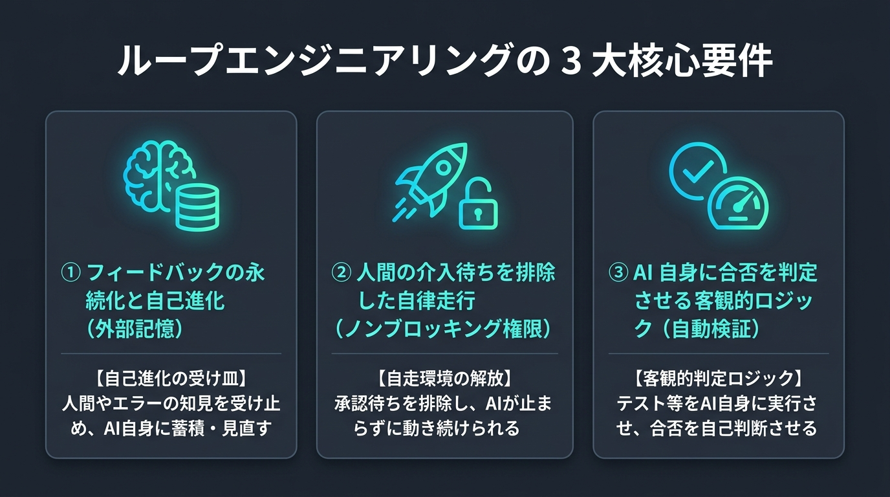
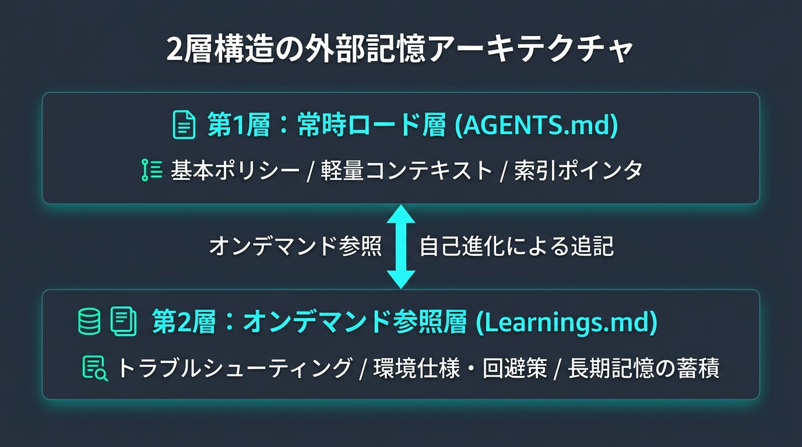

## ループエンジニアリングとは

Google の Addy Osmani 氏は、エッセイ [『Loop Engineering』(2026-06-07)](https://addyosmani.com/blog/loop-engineering/) の中で、ループエンジニアリングを
次のように定義しています。

> エージェントに指示を与える役割を自分自身から切り離し、代わりにその指示を行うシステムを設計すること
> - [Loop Engineering(2026-06-07)](https://addyosmani.com/blog/loop-engineering/)

Claude Code の開発を率いるボリス・チェルニー（Boris Cherny）氏も、次のように語っています。

> 「私はもう、Claude に直接指示を与えていません。Claude に指示を与え、何をすべきかを判断させるループを実行しています。私の仕事は **『ループ（仕組み）』** を書くことです。」
> — Boris Cherny (Head of Claude Code, Anthropic)

> [!NOTE]
> **プロンプトエンジニアリングから「ループエンジニアリング」への転換**
> - **旧来のプロンプトエンジニアリング**:
>   人間が AI と対話しながら 1 問 1 答で手動調整するアプローチ。人間がプロンプトを打ち、出力を目視確認するため、人間の思考速度と確認作業が最大のボトルネックになっていました。
> - **ループエンジニアリング**:
>   AI 自身がツールを実行し、テスト結果から合否を自己判定して自走する**「自動フィードバックの仕組み（自律ループ）」** を設計・構築するアプローチ。人間の役割は「指示係」から「ループの設計者」へとシフトします。

## 自律ループを支える基本要素

Addy Osmani 氏は自律ループを成立させるための **5つの基本要素（Primitives）** と **1つの外部メモリ（Memory）** を整理しています。

| 構成要素 | ループ内での役割 | 具体的な実装例 |
| :--- | :--- | :--- |
| **1. Automations（自動化）** | 定期実行・タスクの探索とトリガー | 定期監視（`/schedule`）、ゴール駆動実行（`/plan`） |
| **2. Worktrees（並行隔離）** | エージェント作業の衝突を防ぐ環境分離 | `git worktree`、独立ブランチでの作業 |
| **3. Skills（スキル）** | 特定タスクに必要な手順書・知識のオンデマンド提供 | Agent Skills（`SKILL.md` / Runbook） |
| **4. Plugins / Connectors** | 外部ツールや API との接続 | MCP（GitHub MCP、各種外部ツール連携） |
| **5. Sub-agents（サブエージェント）** | 実装担当（Maker）と検査担当（Checker）の分離 | 調査用・レビュー用のサブエージェント分割 |
| **+ Memory（外部記憶）** | セッションを跨いだ知見・進捗の永続化 | **`Learnings.md`** や `AGENTS.md` |

特に重要なのが **「Memory（外部記憶）」** です。

Addy 氏が *「The agent forgets, the repo doesn't（エージェントは忘れるが、リポジトリは忘れない）」* と述べている通り、
LLM のコンテキストウィンドウの外側（リポジトリ内の Markdown 等）に状態やルールを逃がして引き継ぐことで、初めてセッションが途切れても継続する自律ループが完成します。

### 5+1 の部品が組み合わさることで生まれる「3 つの核心要件」

上記の「5+1 の要素」は、ループを組み立てるための **「構成部品（Primitives）」** です。
これらが単体で存在するだけでは自律ループは回らず、適切に組み合わさることで初めて後述する **「3 つの核心要件（メカニズム）」** が満たされます。

- **① フィードバックの永続化と自己進化** ◀ `Memory` ＋ `Skills`（知見の蓄積と定型手順のライブラリ化）
- **② 人間の介入待ちを排除した自律走行** ◀ `Automations` ＋ `Worktrees`（環境隔離というハーネスがあるからこそ安全に自走できる）
- **③ AI 自身に合否を判定させる客観的ロジック** ◀ `Plugins (MCP)` ＋ `Sub-agents`（検証ツールの自動実行とレビュー分掌）

## ループエンジニアリングを成立させる 3 つの核心要件

ループエンジニアリングの真髄は、これまで人間が頭を使い、目視で行っていた **「確認・合否判定・やり直し指示（フィードバック）」そのものを、AI と判定ロジックの仕組みによって完全に自動化すること** にあります。

製品やツールの垣根を越えて、自律ループを破綻させずに回し続けるためには、以下の 3 つの本質的な足場が不可欠です。



### 1. フィードバックの永続化と自己進化（外部記憶）

エージェントのコンテキスト肥大化を防ぎつつ、過去の失敗やプロジェクト固有ノウハウを引き継ぐため、外部記憶を **「常時ロード層」** と **「オンデマンド参照・自己進化層」** の 2 つに分離します。



> [!TIP]
> **なぜ 1 つの指示ファイルにまとめてはいけないのか？**
> `AGENTS.md` や `CLAUDE.md` に過去のエラー対策をすべて書き足していく「単一ファイルの肥大化」には、2 つの技術的欠陥があります。
> 
> 1. **トークン消費とコストの爆発（Context Bloat）**:
>    数十〜数百項目におよぶ知見が毎ターン送信され、何もしなくても会話開始時点で大量の入力トークンを消費し、レイテンシと API コストが急増します。
> 2. **指示の希釈と見落とし（Attention Dilution / "Lost in the Middle" 現象）**:
>    スタンフォード大等の研究 **[『Lost in the Middle』(Liu et al., 2023)](https://arxiv.org/abs/2307.03172)** の通り、プロンプトが長大化・ノイズ化するほど重要指示に対する注意が希釈され、指示遵守率が低下して最重要ルールが見落とされるリスクが高まります。


#### 2 層分離設計の動作メカニズム

この課題を解決するのが、**`AGENTS.md`（常時ロード層）** と **`Learnings.md`（オンデマンド参照・自己進化層）** の 2 層構造です。

> [!TIP]
> **なぜ `Learnings.md` は「オンデマンド」になるのか？（システム仕様の仕組み）**
> - **`AGENTS.md`（システムによる常時強制ロード）**:
>   エージェントツールの基盤仕様として、毎ターンのプロンプトに無条件で自動注入されます。
> - **`Learnings.md`（通常ファイルとしてのオンデマンド参照）**:
>   システムが勝手に全行をプロンプトに流し込むことはありません。`AGENTS.md` のポインタ指示に従い、エージェントがファイル操作ツール（`view_file` や `grep_search`）を使って**必要な時だけ能動的に読みに行く通常ファイル**として扱われます。

##### 「ポインタ（参照）」としての `AGENTS.md`
単に `Learnings.md` をリポジトリに置いただけでは、エージェントはそのファイルの存在に気づかない可能性があります。そこで、常時ロードされる `AGENTS.md` に以下のような **ポインタ（索引指示）** を 1 行だけ記述します。

```markdown
- **知見の参照**: 詳細な技術仕様や過去のトラブルシューティングは Learnings.md を参照する。
```

これにより、プログラミングにおける「ポインタ・参照渡し」と同じ構造が作られます。

1. **エージェント起動時**:
   コンテキストには軽量な `AGENTS.md`（数十行）のみが注入され、トークン消費を最小限に抑えます。エージェントは「困ったときは `Learnings.md` という外部ナレッジがある」というポインタ情報のみを把握しています。
2. **タスク実行時（オンデマンド参照）**:
   ビルドエラーや環境固有の仕様に直面した際、エージェントは `AGENTS.md` のポインタ指示に従い、ツール経由で `Learnings.md` をピンポイントで検索・読み込みます。
3. **タスク完了時（自己進化）**:
   新しいバグ修正や仕様の発見があった場合、エージェント自身が `Learnings.md` の末尾に知見を自律的に追記・更新します。

> [!TIP]
> **知見からスキル（Skills）への昇格**
> `Learnings.md` に蓄積された断片的な教訓のうち、定型化・複雑化した手順やワークフローは **`Skills`（`.agents/skills/*/SKILL.md`）** へ昇格させます。
> スキルは常時ロードされず「名前と概要（メタデータ）」だけが軽量に保持され、**該当するタスクの実行時のみ全文がオンデマンドで読み込まれる**ため、トークンを浪費することなく高度な専門手順をライブラリ化できます。


> [!NOTE]
> **2 層外部記憶の学術的ルーツと実務での成立背景**
> 
> **① 学術研究におけるルーツ（外部メモリと自己反省）**
> - **[Reflexion (Shinn et al., 2023 / NeurIPS 2023)](https://arxiv.org/abs/2303.11366)**:
>   タスク失敗時に自然言語で自己反省（Self-reflection）を行い、言語的メモリ（Verbal Memory）に蓄積して次回試行時に参照させることで、同一エラーの再発を防ぐ手法を実証。
> - **[Voyager (Wang et al., 2023 / スタンフォード大・NVIDIA 等)](https://arxiv.org/abs/2305.16291)**:
>   Minecraft 自律エージェントにおいて、獲得したスキルや手順をディスク上の Skill Library に保存し、必要に応じて動的に検索・再利用する自律学習モデルを確立。
> 
> **② 実務におけるデファクト化と命名の由来**
> - **事後検証文化（Post-mortem）との接続**:
>   障害対応の振り返りで得られた教訓を「Key Learnings」として文書化するエンジニアリング文化から、`Learnings.md` という標準ファイル名が自然発生的に定着。
> - **Addy Osmani 氏による「Memory Primitive」の体系化**:
>   Google の Addy Osmani 氏が [『Loop Engineering』(2026-06-07)](https://addyosmani.com/blog/loop-engineering/) の中で *「The agent forgets, the repo doesn't（エージェントは忘れるが、リポジトリは忘れない）」* と定義し、2 層構造が自律ループの基本設計として確立。

---

### 2. 人間の介入待ちを排除した自律走行（ノンブロッキング権限）

**Automations（ゴール駆動実行や定期監視）** によってエージェントを自走させる際、コマンドを実行するたびに対話型の承認プロンプト（Confirmation）を挟むと、自律ループがブロックされて人間が再び作業のボトルネックになります。

日常的に使用するテスト・ビルド・Git コマンドを事前許可し、**「人間の確認待ちによるループ停止」を排除** して AI を止まらずに自走させます。

> [!NOTE]
> **Worktrees とハーネス（隔離と可逆性の保証）があるからこそ権限を委譲できる**
> 「AI が勝手にコマンドを実行して環境を壊さないか？」という懸念は、**`Worktrees`（作業ツリー・ブランチの完全分離）** や **専用 Docker コンテナ（ハーネス）** によって、**影響の隔離（Sandboxing）と可逆性（Reversibility）** を担保することで完全に解消されます。
> 失敗しても瞬時に安全なロールバックが保証されているからこそ、人間は安心してノンブロッキングな権限を預けることができます。

---

### 3. AI 自身に合否を判定させる客観的ロジック（自動検証）

人間が画面に張り付いて良し悪しを目視チェックするのをやめ、**Plugins / MCP（ツール実行）** を通じて「自動テストやビルドスクリプト」を AI 自身に実行させ、合否を自己判断・自己修復させます。

また、複雑なタスクにおいては **Sub-agents（サブエージェント）** を活用し、実装担当（Maker）と検査・レビュー担当（Checker）を分掌させることで、人間の代わりに機械的で客観的な二重判定ループを自律的に回すことが可能になります。

> [!TIP]
> **Fast Observability（高速な自動検証）を成立させる 4 大要件**
> 1. **5秒以内に完了する**: 検証が遅いと自己修復ループ全体の回転が鈍化します。
> 2. **明確な終了コード（Exit Code 0/1）**: 成功時は `0`、失敗時は非ゼロを返し、AI が機械的に合否を自己判定できるようにします。
> 3. **わかりやすい標準エラー出力（stderr）**: エラー行やスタックトレースを出力し、AI が自力で原因特定・自己修正できるようにします。
> 4. **知見の正確性フィルター**: 自動検証（テストやビルド）をパスして再現性が証明された解決策だけを、外部記憶（`Learnings.md`）に蓄積する本物の知見として認定します。

---

## Antigravity CLIにおけるループエンジニアリングの実践

これまで解説した **「3 つの核心要件」** を、Antigravity CLI（`agy`）の各機能（5+1 の構成要素）を使って具体的にどう設定・実装するかを解説します。

### 3 つの核心要件と Antigravity CLI 機能の実装対応

| 核心要件 | Antigravity CLI での実装要素（5+1） | 具体的なツールと設定ファイル |
| :--- | :--- | :--- |
| **1. フィードバックの永続化と自己進化** | **Memory** ＋ **Skills** | `AGENTS.md`、`Learnings.md`、`.agents/skills/*/SKILL.md` |
| **2. 人間の介入待ちを排除した自律走行** | **Permissions** ＋ **Worktrees** ＋ **Automations** | `settings.json`（権限設定）、`Workspace: "branch"`、`/plan`、`/schedule` |
| **3. AI 自身に合否を判定させる客観的ロジック** | **Fast Observability** ＋ **Plugins** ＋ **Sub-agents** | 自動検証コマンド、GitHub MCP、Checker サブエージェント |


### 具体的な環境設定

当ブログ環境における、3 つの核心要件の具体的なセットアップ手順です。

#### 1. フィードバックの永続化：外部記憶とスキル（Memory ＋ Skills）

- **外部記憶（`AGENTS.md` / `Learnings.md`）**:
  プロジェクト直下の `AGENTS.md` に、基本方針と `Learnings.md` に対する参照・自己進化（追記・週次整理）ルールを記述します。

```markdown
# 自律動作ポリシー
- **自律完遂**: 軽微なエラーやビルド失敗は、質問を挟まず自律的に修正して完走すること。
- **知見の参照**: 詳細な技術仕様や過去のトラブルシューティングは `Learnings.md` を参照すること。
- **自己進化**:
  - 作業完了時、確定した知見やユーザーからの指摘事項を `Learnings.md` に要約追記すること。
  - `Learnings.md` の新規作成時、冒頭に「最終整理日: [当日の日付(YYYY-MM-DD)]」を記載すること。
  - 最終整理日から 1 週間以上経過している場合、内容を整理して日付を当日の日付に更新すること。
```

- **スキルのライブラリ化（`.agents/skills/*/SKILL.md`）**:
  定型化された複雑なワークフロー（例：記事の新規作成手順、画像生成ルール等）は、ディレクトリごとに `SKILL.md` として切り出し、必要な時だけオンデマンドでエージェントに読み込ませます。

#### 2. 自律走行の解放：権限・環境隔離・自動化（Permissions ＋ Worktrees ＋ Automations）

- **ノンブロッキング権限（`settings.json`）**:
  日常的に使用する検証コマンドや Git コマンドを `~/.gemini/antigravity-cli/settings.json` の `permissions.allow` に登録し、確認プロンプトによるループ停止を排除します。

```jsonc
{
  "permissions": {
    "allow": [
      "command(hugo*)",
      "command(npm test*)",
      "command(git status)",
      "command(git diff)",
      "command(git log)",
      "command(git commit*)"
    ]
  }
}
```

- **作業環境の隔離（Worktrees / `Workspace: "branch"`）**:
  サブエージェント呼び出し時に `Workspace: "branch"` を指定し、Git のブランチ・作業ツリーを完全に分離。メイン環境を破壊するリスクを排除します。
- **自走トリガー（`/plan` や `/schedule`、非対話モード `-p`）**:
  ゴール駆動実行（`/plan`）や定期監視（`/schedule`）、CI連携（`agy -p`）により、人間の手動入力を介さずに自走ループを回します。

#### 3. 客観的判定ロジック：自動検証・ツール・分掌（Fast Observability ＋ Plugins ＋ Sub-agents）

- **高速な自動検証（Fast Observability）**:
  エージェントが自己修復ループを回すための「客観的な合否判定コマンド」を用意します。
  当ブログでは、出力先（`public/`）の過去キャッシュを完全消去した上で、全ページのメタデータ・Markdown 構文・テンプレート（Sass/i18n）の整合性をゼロから 1 秒台で検証するコマンドを定義しています。1 箇所でも不整合があれば Exit Code 1 と明確なエラー行（stderr）が出力されるため、AI が自力で即座に自己修正できます。

```bash
# 出力先をクリーンにして全ページの構文・アセット整合性を1秒で機械判定（Exit Code 0/1）
hugo --cleanDestinationDir
```

- **外部ツール連携（MCP サーバー / Plugins）**:
  GitHub MCP などの **MCP サーバー（Model Context Protocol）** を連携させ、リモートリポジトリの Issue 取得、PR 作成、ファイル操作をエージェントに直接実行させます。
- **レビュー分掌（Sub-agents による Maker / Checker 分離）**:
  コードを実装する「Maker エージェント」と、テスト・レビューを担当する「Checker サブエージェント」を `invoke_subagent` で分担させ、客観的な二重判定ループを自律実行させます。

### 他のエージェントツールへの普遍的応用

本記事で解説した 3 大核心要件（2 層外部記憶・ノンブロッキング自走・客観的自動検証）は、Antigravity CLI に限らず、Claude Code や Cursor などの主要なコーディングエージェント環境にもそのまま応用できる普遍的な設計パターンです。

| 核心要件・設計要素 | Antigravity CLI | Claude Code | Cursor |
| :--- | :--- | :--- | :--- |
| **常時ロード層** | `AGENTS.md` | `CLAUDE.md` | `.cursor/rules/*.mdc` |
| **オンデマンド外部記憶** | `Learnings.md` | `Learnings.md` | `Learnings.md` / Notepads |
| **自走コマンド** | `/plan`, `/schedule` | `claude -p` / `--dangerously-skip-permissions` | Agent Mode（Yolo モード） |
| **高速自動検証** | ターミナルコマンド | ターミナルコマンド | Terminal Tool / Task Runner |

---

## ループが破綻する 3 つのアンチパターンと処方箋

実務で自律ループを導入しようとして失敗する典型的な落とし穴と、その回避策（処方箋）をまとめます。

### 1. 検証が遅すぎる（Slow Feedback Trap）
- **落とし穴**: テストやビルドに 1 分以上かかると、エージェントの自己修正ループが鈍化し、試行回数が稼げずにトークンと時間だけが浪費されます。
- **処方箋**: 重厚な E2E テストではなく、**5 秒以内で完了する単体テスト・構文チェック・クリーンビルド（`--cleanDestinationDir`）** を一次判定機としてエージェントに渡します。

### 2. 曖昧な成否判定（False Positive Trap）
- **落とし穴**: 内部でエラーが発生しているのに終了コード（Exit Code 0）を返してしまうスクリプトや、過去のビルドキャッシュが残っていると、AI は「成功した」と誤認して壊れた状態で作業を終了します。
- **処方箋**: 出力先をゼロクリアし、**異常時は必ず非ゼロ（Exit Code 1）と明確なエラーログ（stderr）を出力する厳格な判定ロジック** を徹底します。

### 3. 外部記憶の放置と肥大化（Knowledge Rot Trap）
- **落とし穴**: `Learnings.md` に追記しっぱなしで数ヶ月放置すると、重複した知見や過去の古いバージョンの一時的な回避策が残り続け、エージェントを惑わせるノイズになります。
- **処方箋**: `AGENTS.md` に**週次（またはサイズ閾値）の自律リファクタリングルール**を仕込み、エージェント自身に定期的な棚卸しを行わせます。

---

## まとめ：プロンプトを工夫するな、AI が勝手に直す「仕組み」を作れ

AI を使うたびにプロンプトの言い回しを工夫し、出力されたコードを目視でチェックして「ここを直して」と指示し直す――このやり方を続けている限り、人間が一番のボトルネックであり続けます。

ループエンジニアリングが目指すのは、**「人間がやっていた確認と指示出し（フィードバック）を、AI 自身に自動で行わせること」** です。

もちろん、この自律ループを成立させる絶対条件として、まず **「Docker やブランチによる影響の隔離と、いつでも巻き戻せる可逆性を保証する安全な環境（ハーネス）」** が不可欠です。

この安全な土台の上で、以下の 3 つの足場を整えて AI 自身に自律サイクルを実行させます。

1. **フィードバックの永続化（外部記憶）**: 受け皿（`AGENTS.md` ＋ `Learnings.md`）を用意し、知見の追記と定期棚卸しを AI 自身に自律実行させる
2. **人間の介入待ちを排除した自律走行（権限解放）**: 承認プロンプトによる停止を排し、AI が止まらずに自走し続けられる環境を渡す
3. **AI 自身に合否を判定させる客観的ロジック（自動検証）**: テストやビルドを AI 自身に実行させ、エラーから自力で原因特定・自己修復させる

「AI にどう指示を出すか」で悩む時間をやめ、**「安全なハーネス（環境）の上で、AI が自分で走って自分で直せる仕組み」** を構築する。
これこそが、開発者がプロンプトの泥沼から解放され、AI の真の自律性を引き出すためのループエンジニアリングの実践です。

---

## 参考リンク・情報ソース

### 学術論文（自律エージェント・外部記憶・コンテキスト特性）
- [Lost in the Middle: How Language Models Use Long Contexts (Liu et al., 2023 / TACL 2024)](https://arxiv.org/abs/2307.03172)
- [Reflexion: Language Agents with Verbal Reinforcement Learning (Shinn et al., 2023 / NeurIPS 2023)](https://arxiv.org/abs/2303.11366)
- [Voyager: An Open-Ended Embodied Agent with Large Language Models (Wang et al., 2023)](https://arxiv.org/abs/2305.16291)
- [Voyager Project Page (MineDojo / Stanford / NVIDIA)](https://voyager.minedojo.org/)


### ループ工学・エージェント設計
- [Addy Osmani: Loop Engineering (2026-06-07)](https://addyosmani.com/blog/loop-engineering/)
- [Acquired Unplugged (WorkOS): Boris Cherny on Claude Code and Agent Loops (2026-06-02)](https://www.youtube.com/watch?v=RkQQ7WEor7w)
- [Peter Steinberger (@steipete): Discussions on Coding Agent Loops and Harnesses](https://x.com/steipete)

---

## 関連記事

- [Copilot・Cursor・Antigravity のカスタム指示ファイル設定まとめ](/posts/2026/08/ai-coding-rules-comparison/)
- [Agent Skills の仕様と書き方メモ：手順書（Runbook）のオンデマンド読み込み](/posts/2026/08/agent-skills-introduction/)
- [Dev Containers による開発環境のコード化と Hugo + AIエージェント構成例](/posts/2026/08/devcontainers-introduction/)
- [Model Context Protocol（MCP）の仕組みと設定方法メモ](/posts/2026/08/mcp-introduction/)


