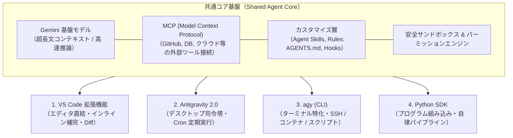
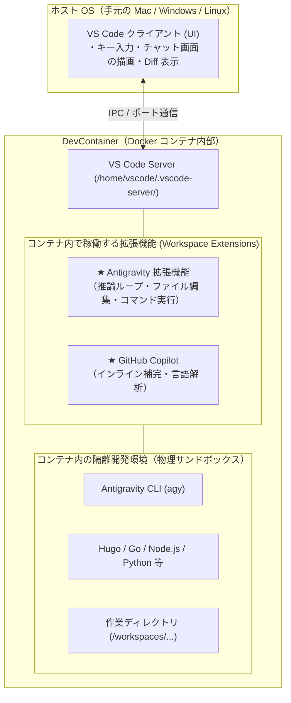
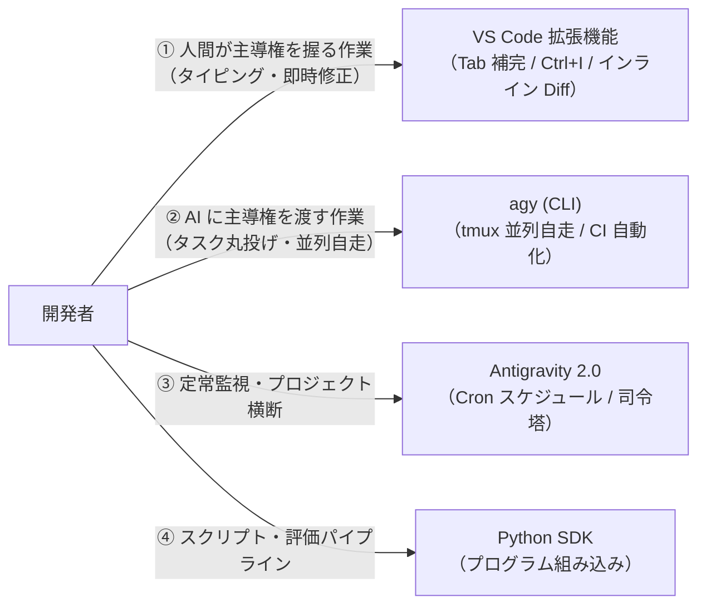

> [!NOTE] 個人用メモ・備忘録
> 日々の開発・インフラ検証の備忘録として残している個人ノートです。手元環境での動作ログをもとにまとめています。環境差異等もあるため、参考にされる場合はご自身の環境で検証の上ご活用ください。

## はじめに

2026 年 8 月 19 日、Google Antigravity の **VS Code 向け公式拡張機能（Antigravity Extension for VS Code）** がリリースされました。

これまでスタンドアロンの AI エディタ（Antigravity IDE）やデスクトップアプリ（Antigravity 2.0）、ターミナル用 CLI（`agy`）で提供されていた自律エージェント機能が、使い慣れた通常の VS Code 環境へ直接アドオンできるようになりました。

「従来の Gemini Code Assist と何が違うのか？」「デスクトップアプリ（Antigravity 2.0）や CLI（`agy`）とはどう使い分ければよいのか？」という疑問を持つ開発者も多いはずです。

本記事では、Gemini Code Assist から Antigravity への進化の背景、共通するエージェントコアのアーキテクチャ、そして **4 つの提供形態（Surfaces: VS Code 拡張機能、Antigravity 2.0、`agy` CLI、Python SDK）の特徴と実務での使い分け** を整理します。

---

## 開発者 AI が直面していた「形態の分断」と進化の必然性

AI を活用したコーディング支援は、インラインのコード補完（Tab）やチャットウィンドウでの対話から始まりました。しかし、開発規模が大きくなるにつれて以下のような構造的課題が顕在化しました。

1. **「提案」止まりによる手動作業のボトルネック**:
   - 従来の Gemini Code Assist や一般的な AI 拡張機能は、コード修正やコマンドをチャット欄で「提案」し、ユーザーが手動でエディタに貼り付け、ターミナルで実行してエラーが出たら再度チャットに貼る、という対話が中心でした。
2. **手動モード切り替え（Ask / Edit / Agent）の煩雑さ**:
   - 「質問だから Ask」「特定行の修正だから Edit」「自動実行させたいから Agent」と、作業ごとに手動で UI モードを切り替える必要がありました。
3. **作業環境によるツールの分断**:
   - GUI エディタ上では便利な補完が効く一方、SSH 先のリモートサーバー、コンテナ内部、あるいは CI/CD スクリプトなどのターミナル環境では同じ AI 支援を利用しにくいという断片化がありました。

```text
【従来の開発スタイル（受動型）】
ユーザーが指示 ➔ AI がコード提案 ➔ ユーザーが手動適用 ➔ ユーザーが手動テスト ➔ エラーを目視確認

【Antigravity の自律ループスタイル（エージェント型）】
ユーザーがゴールを指示 ➔ AI が計画策定 ➔ ファイル自律編集 ➔ テスト・ビルドを自律実行 ➔ エラーを読み取り自己修復
```

Antigravity は、これらの課題を解消し、**「単一のエージェントコアエンジンを、エディタ・デスクトップ・ターミナル・プログラムの 4 つの窓口（Surfaces）から一貫して利用できるプラットフォーム」** として再設計されました。

---

## 共通基盤アーキテクチャ（Shared Agent Core）

Antigravity のすべてのツール（拡張機能、デスクトップ、CLI、SDK）は、独立した別々の製品ではなく、**共通のエージェント基盤** を共有しています。



### 共通コアが提供する 4 大要素

1. **Gemini 基盤モデル**:
   - 巨大なコンテキストウィンドウと高速・低遅延な推論により、リポジトリ全体のコンテキストを把握しながら自律ループを駆動。
2. **Model Context Protocol (MCP)**:
   - Linux Foundation（AAIF）傘下で標準化されたオープン規格に準拠し、GitHub MCP やデータベース接続、カスタムツールを共通で利用可能。
3. **オープンな設定・スキル規格**:
   - プロジェクト固有のルールは `AGENTS.md`、定型タスク手順は `Agent Skills`（`SKILL.md`）、統合パッケージは `Agent Plugins`（`plugin.json`）として全サーフェス共通で読み込み。
4. **安全なサンドボックス & パーミッション**:
   - ターミナルコマンドの実行ポリシー（許可・確認・サンドボックス隔離）を共通ルールで制御。

---

## 提供形態（Surfaces）の比較と特徴

共通コアの上に構築された 4 つのインターフェースは、開発者の作業シーンに応じて最適化されています。

| ツール / サーフェス | インターフェース | 主な役割 | 代表的な利用シーン |
| :--- | :--- | :--- | :--- |
| **VS Code 拡張機能** | GUI エディタ統合 | **エディタ直結ペアプログラマ** | 日常のコーディング、インライン補完（Tab）、選択範囲のピンポイント修正（`Ctrl+I`）、Visual Diff 確認 |
| **Antigravity 2.0** | デスクトップアプリ (Electron) | **エージェント司令塔** | プロジェクト横断管理、定期自動化タスク（Cron）、エディタから独立したチャットキャンバス |
| **`agy` (CLI)** | ターミナル (CUI / TUI) | **ターミナル特化エージェント** | SSH 先サーバー、コンテナ内作業、キーボード完結の高速操作、CI / スクリプト自動化（`-p`） |
| **Python SDK** | Python ライブラリ | **プログラム組み込み** | Python スクリプトからのエージェント呼び出し、自律評価パイプライン、カスタム CLI 開発 |

---

### 1. VS Code 拡張機能（エディタ一体型）

2026 年 8 月 19 日に正式提供が開始された拡張機能です。使い慣れた VS Code の設定、テーマ、拡張機能、Dev Containers 環境をそのまま維持しながら Antigravity を利用できます。

```text
[ VS Code エディタ画面 ]
┌───────────────────────────────┬───────────────────────────────┐
│ 1. エディタ領域               │ 3. サイドバーチャット         │
│  - Antigravity Tab (補完)     │  - Agent Mode (自律実行)      │
│  - Supercomplete (一括差分)   │  - Planning Mode (計画承認)   │
│  - Ctrl+I (インライン編集)    │  - サブエージェント監視       │
│  - インライン Diff 表示       │                               │
├───────────────────────────────┴───────────────────────────────┤
│ 2. 統合ターミナル / Problems 自動修正（1 クリック修復）       │
└───────────────────────────────────────────────────────────────┘
```

#### 主な機能
* **Antigravity Tab / Supercomplete**:
  - カーソル位置での単行補完だけでなく、複数行にわたる一括差分（削除・追加・import の自動挿入）を Tab キー 1 つで適用。
* **Inline Command (`Ctrl+I` / `Cmd+I`)**:
  - 対象コードをハイライトしてショートカットを押し、「この関数に型アノテーションを追加して」とピンポイントで指示。
* **Visual Diff Overlays**:
  - エディタのコード上に直接赤緑のインライン Diff が表示され、変更内容を目視で確認しながら個別に採否を決定可能。
* **Problems 連携**:
  - コンパイラエラーや Linter の警告から「Fix with Agent」を 1 クリックして自動修正。

#### 補足：DevContainer 環境における拡張機能の動作構造
DevContainer（コンテナ開発環境）を利用している場合、拡張機能が「ホスト側」と「コンテナ側」のどちらに導入・実行されるのかという疑問が生じます。

VS Code は **「UI 描画（ホスト側）」** と **「実行エンジン（コンテナ側の VS Code Server）」** が完全に分離されたアーキテクチャを採用しています。Antigravity 拡張機能や GitHub Copilot は **Workspace Extensions** に分類され、**DevContainer 内部（`/home/vscode/.vscode-server/extensions/`）に自動注入されてコンテナ内のプロセスとして動作** します。



- **CLI (`agy`) との構造的な違い**:
  - `agy` CLI が「コンテナ内のターミナルで直接叩く」のに対し、Antigravity 拡張機能は「コンテナ内の `VS Code Server` 上で動作しつつ、ホスト側の VS Code UI と通信」します。
- **物理サンドボックスによる安全性**:
  - CLI であれ拡張機能であれ、エージェントが操作するファイルや実行するシェルコマンドはすべて **コンテナ内部に隔離** されているため、ホスト OS の破壊や誤操作の心配なく安全に自走させることができます。

#### GitHub Copilot 拡張機能との設計思想の違い
VS Code で標準的に利用される **[GitHub Copilot](https://docs.github.com/en/copilot)** と **Antigravity 拡張機能** は、同じエディタ内 AI であっても設計思想が明確に異なります。

| 比較項目 | GitHub Copilot 拡張機能 | Antigravity 拡張機能 |
| :--- | :--- | :--- |
| **設計思想** | **「副操縦士（Co-pilot / In-the-loop）」**<br>人間のタイピングや思考の流れを妨げず支援 | **「自律エージェント（Autonomous Partner）」**<br>計画立案から実装・検証までを自走完遂 |
| **得意な役割** | ・リアルタイムのコード補完（Tab 補完）<br>・選択範囲のインライン生成（`Ctrl+I`）<br>・GitHub（PR / Issue / Review）連携 | ・複数ファイルにまたがる設計・リファクタ<br>・テスト実行とエラーの自律自己修復ループ<br>・MCP / Skills / Subagents の連携 |
| **計画管理** | 会話ログベース（チャット履歴） | **アーティファクト管理**（`implementation_plan.md` や `walkthrough.md`） |
| **指示ファイル** | `.github/copilot-instructions.md` | `AGENTS.md`、`.agents/plugins/`、`SKILL.md` |

手元の細かなタイピングには Copilot を使い、機能全体の実装や自律調査には Antigravity を使うといった **「In-the-loop と Out-of-the-loop の併用」** が実務における効果的なアプローチです。

---

### 2. Antigravity 2.0（デスクトップ司令塔）

IDE（エディタ）の画面とは独立して動作する、スタンドアロンのデスクトップ Electron アプリケーションです。

#### 主な機能
* **プロジェクト横断管理**:
  - 複数のリポジトリやワークスペースを左サイドバーで切り替え、並行してエージェントにタスクを委譲。
* **定期実行タスク（Scheduled Tasks / Cron）**:
  - 「毎朝 9 時に依存関係の脆弱性をスキャンする」「1 時間ごとにビルド状況をチェックする」といった Cron スケジュールを GUI 上で設定・監視。
* **独立したチャットキャンバス**:
  - エディタの表示領域を狭めることなく、大画面でエージェントとの設計議論や `implementation_plan.md` のレビューに専念。

---

### 3. Antigravity CLI (`agy`)（ターミナル特化）

GUI を持たない環境や、ターミナルからキーボード操作のみで爆速で作業したい開発者向けの公式 CUI / TUI ツールです。

#### 主な機能
* **ターミナル完結の対話型 TUI**:
  - ターミナルで `agy` を起動するだけで、スラッシュコマンド（`/help`, `/plan`）や `@` メンションを使った対話が可能。
* **ヘッドレス / リモート環境対応**:
  - GUI が存在しない SSH 先のクラウド VM や、Docker コンテナ内部でもそのまま動作。
* **非対話モード（`-p` / Prompt）による自動化**:
  - `agy -p "Issue #42 の内容を修正してテストを実行"` のように、シェルスクリプトや CI パイプラインからエージェントを直接呼び出してタスクを完遂。

```bash
# 対話型 TUI の起動
agy

# 非対話型でのワンショット実行（CI / スクリプト連携）
agy -p "全ファイルの型チェックを行い、エラーがあれば修正してください"
```

---

### 4. Antigravity Python SDK（プログラム組み込み）

Python コードから直接エージェントを呼び出し、カスタムな自律ワークフローや評価スクリプトを構築するための公式 SDK です（PyPI: `google-antigravity`）。

```python
import asyncio
from google.antigravity import Agent, LocalAgentConfig, CapabilitiesConfig

async def main():
    # デフォルトは安全のため読み取り専用（Read-only）。
    # ファイル編集やコマンド実行を許可する場合は CapabilitiesConfig() を指定する。
    config = LocalAgentConfig(
        system_instructions="あなたはコード品質を検証する専門エージェントです。",
        capabilities=CapabilitiesConfig(),
    )

    async with Agent(config) as agent:
        # 非同期ストリーミングでエージェントと対話
        response = await agent.chat("tests/ 配下のユニットテストを実行して結果を要約して")
        async for token in response:
            print(token, end="", flush=True)
        print()

if __name__ == "__main__":
    asyncio.run(main())
```

#### 主な特徴と用途
* **デフォルト安全設計（Read-only デフォルト）**:
  - `CapabilitiesConfig()` を明示しない限りツール実行（ファイル書き込みやシェル実行）がブロックされ、安全にコードベースを探索可能。
* **リアルタイム可観測性（Streaming Thoughts / ToolCalls）**:
  - トークンだけでなく、エージェントの思考ログ（`response.thoughts`）や呼び出されたツール（`response.tool_calls`）をプログラムからリアルタイムにフック・監視可能。
* **代表的なユースケース**:
  - テスト・デプロイ自動化パイプラインへの組み込み
  - 社内専用のカスタム AI エージェント CLI 開発
  - 大規模コードベースに対するバッチリファクタリング スクリプト

---

## 機能差の縮小によって浮き彫りになった「GUI と CLI の真の役割分担」

エージェント技術の進化初期、GUI（コード補完や対話チャット）と CLI（ファイル編集・自律ループ）の間には明確な「機能差」が存在し、住み分けは単純でした。

しかし現在、VS Code 拡張機能や Cursor などの GUI 側も「自律エージェント機能（ツール実行、ファイル編集、MCP 連携）」をフル装備し、カタログスペック上の機能差は大分縮まりました。

「GUI でもエージェントが動くなら、なぜ CLI を使うのか？」── 2025〜2026 年にかけて開発者コミュニティで白熱したこの疑問は、**「Suggestion（提案・手元アシスト）」と「Delegation（委譲・自律自走）」という 2 つのパラダイムの違い** によって鮮やかに解き明かされています。

> [!NOTE] Suggestion 型（提案）と Delegation 型（委譲）の設計思想の違い
> [Dev.to や国内外の開発者コミュニティの議論](https://dev.to) でも指摘されている通り、AI コーディング環境は以下の 2 つの設計思想に分化しています。  
> 1. **Suggestion-based（In-the-loop / 提案型）**: 人間がエディタでコードを書く作業を 1 行ずつ手元で補完・アシストする（GUI エディタが最適）。  
> 2. **Delegation-based（Out-of-the-loop / 委譲型）**: ゴールを指示してテスト・自己修復まで丸ごと任せて自走させる（ターミナル / CLI が最適）。  
> 開発環境を「視覚的にコードを検分する工房（Studio）」と捉えるか、「コマンドで自律群を指揮する司令塔（Cockpit）」と捉えるかによって、最適解が異なります。

---

## なぜバイブコーディングや自律実行では CLI が最適解なのか？

2025 年 2 月、AI 研究者の Andrej Karpathy 氏（元 OpenAI 共同創設者 / 元 Tesla AI ディレクター）は、AI 時代の新しい開発パラダイムとして **「バイブコーディング（Vibe Coding）」** を提唱しました。

> [!NOTE] Andrej Karpathy 氏による「バイブコーディング」の提唱
> 「構文（シンタックス）の細部を書く作業から完全に離れ、大まかな意図（バイブス）だけを自然言語で伝え、コードの存在すら忘れて指数関数的な開発速度に身を委ねる新しいコーディング様式」  
> ── [Andrej Karpathy 氏の X ポスト（2025 年 2 月 2 日）](https://x.com/karpathy/status/1886192184808247467)

このような「人間がコードを手書きするのではなく、AI に実装を一気に委譲して自律自走させる開発スタイル」において、なぜ GUI エディタではなく **CLI（ターミナル環境）が決定打（最適解）** となるのか？ 開発者コミュニティや AI 研究所の検証から、以下の 4 つのアーキテクチャ的要因が明らかになっています。

### 1. 直接実行力と低レイテンシ（High Agency & Native Habitat）
* **GUI の制約（提案・描画のオーバーヘッド）**:
  GUI エディタ上の AI は、エディタの仮想 DOM 描画や UI 状態管理を挟むため、差分提示やダイアログ確認など「人間への提案（Suggestion）」が中心になりやすく、動作速度や自律性に制約がかかります。
* **CLI の優位性（OS レイヤーへの直結）**:
  Anthropic の [Claude Code](https://docs.anthropic.com/en/docs/agents-and-tools/claude-code) や [Aider](https://aider.chat/) の設計思想が示すように、ターミナルはエージェントにとっての「母艦（Native Habitat）」です。OS のシェル、ファイルシステム、Git、パッケージマネージャーに直接アクセスし、UI のオーバーヘッドなしに自律コマンドを高速実行できます。

### 2. 「コマンド検索」によるコンテキスト純度（S/N 比）の極大化
* **GUI の課題（暗黙コンテキストによる注意の希釈 / Context Pollution）**:
  GUI エディタの AI は利便性のために「開いているタブ」や周辺ファイルを自動的にプロンプトへ詰め込みます。しかし、大規模なコードベースにおいて無関係なファイルが混入すると、**Attention Dilution（注意の希釈 / [Lost in the Middle 現象](https://arxiv.org/abs/2307.03172)）** が発生し、指示の見落としやハルシネーションの原因になります。
* **CLI の優位性（外科手術のような高純度コンテキスト）**:
  CLI 環境のエージェントは、`rg`（ripgrep）、`fd`、`jq`、`git log` などの高速な UNIX ツールを自ら実行し、**「該当する関数の前後 10 行だけ」「直近のエラーログのスタックトレースだけ」を外科手術のようにピンポイントで切り出してプロンプトに注入（Progressive Disclosure）** します。不要なノイズを完全に削ぎ落とし、コンテキストの S/N 比を極大化することで、推論とコード修正の精度が劇的に向上します。

### 3. 「作って終わり」にしない自己検証・修復ループ（Execution-Feedback Loop）
バイブコーディングの本質は、コードを一括生成した後の **「テストが通るまでの自走・自己修復（Test-Driven Self-Correction）」** にあります。
* **実行環境直結の強み**:
  Princeton 大学の [SWE-agent](https://swe-agent.com/) / SWE-bench 等の研究でも実証されている通り、自律エージェントの成功率は「コードを生成した直後にシェル環境で即座にビルド・テストを実行し、その標準出力・エラーメッセージをフィードバックとして受け取れるか」に大きく依存します。
* **CLI の完走力**:
  CLI 環境のエージェントは、コード修正直後に自ら `npm test` や `pytest`、`go test` を叩き、型エラーやテスト落ちを検知して自律修正するループを何ターンでも完走させます。人間が画面に戻ってきた時には、すでにテストをパスした検証済みの完成品が出来上がっています。

### 4. マルチプレキシング（5〜10 台以上の並列同時自走）
Anthropic の Claude Code 開発リードである [Boris Cherny 氏ら](https://docs.anthropic.com/en/docs/agents-and-tools/claude-code) が実践し提唱している最大の生産性ハックが **「マルチプレキシング（Agent Multiplexing / 並列自走）」** です。
* **`git worktree` による作業の完全隔離**:
  `git worktree` を使って作業ツリーとブランチを分離し、ターミナル上で **5〜10 台以上のエージェント（`agy` や Claude Code）を同時に並行自走** させます（Issue 調査、API 実装、テスト追加、ドキュメント更新を同時進行）。
* **オーケストレーターへの進化**:
  GUI エディタで 5 つ以上のウィンドウを開いてエージェントを動かすと、タブが氾濫して画面が崩壊し、メモリ消費で開発マシンが悲鳴を上げます。**「エージェントの群れ（Swarm）を指揮するオーケストレーター」として動く場合、軽量で画面を奪わず、バックグラウンド実行や通知と親和性の高いターミナル / CLI こそが唯一の現実解** となります。

---

## 提供形態ごとの最終的な役割分担

| 開発のフェーズ・目的 | 要求されるコア技術 | 最適なツール |
| :--- | :--- | :---: |
| **① 大規模自律実行 & バイブコーディング**<br>（機能一括構築、重いリファクタ、無人CI） | ・高密度なコンテキスト収集（`rg`/`jq`）<br>・制限のないシェル実行（Tool Space）<br>・`git worktree` による並列分散自走 | **CLI 版 (`agy`)** |
| **② 人間主導の手元アシスト**<br>（Tab補完、1行修正、型エラー即時修正） | ・エディタ未保存メモリ/LSP への同期<br>・カーソル座標のリアルタイム把握<br>・インライン赤緑 Diff レビュー | **VS Code 拡張機能** |



---

## まとめ

機能差が縮まった現在、それぞれのツールの存在価値は以下のように美しく整理されます。

- **エージェントの「頭脳・自律能力・調査力・完走力」を最大化したいとき（バイブコーディング、重いタスク、自動化）**
  ➔ **CLI 版（`agy`）が機能的・アーキテクチャ的に絶対の最適解**。
- **「人間がエディタでコードを書く作業を、手元で気持ちよくアシストさせたいとき（補完・即時修正）」**
  ➔ **GUI 版（VS Code 拡張機能）が UI として最適**。

状況に応じて最適なインターフェースを選択・併用することで、AI エージェントの自律性を最大限に引き出した開発環境を構築できます。

> ※ 本記事の構成検討・技術仕様の検証・Hugo による静的ビルド検証・推敲は、AI コーディングエージェントとの自律協働ループによって執筆・検証されています。

---

## 参考リンク・情報ソース

- [Google Antigravity Documentation (antigravity.google/docs)](https://antigravity.google/docs)
- [Antigravity CLI Reference (antigravity.google/docs/cli/reference)](https://antigravity.google/docs/cli/reference)
- [Antigravity Python SDK (GitHub: google-antigravity/antigravity-sdk-python)](https://github.com/google-antigravity/antigravity-sdk-python)
- [Model Context Protocol Specification (modelcontextprotocol.io)](https://modelcontextprotocol.io)
- [Agent Skills Runbook Specification (agentskills.io)](https://agentskills.io)
- [Agent Plugins: Open Specification (agent-plugins.org)](https://agent-plugins.org)
- [Andrej Karpathy: "There's a new kind of coding I call 'vibe coding'..." (X Post, Feb 2025)](https://x.com/karpathy/status/1886192184808247467)
- [Boris Cherny / Anthropic: Claude Code & Agent Multiplexing Workflow](https://docs.anthropic.com/en/docs/agents-and-tools/claude-code)
- [Aider: AI Pair Programming in your Terminal (aider.chat)](https://aider.chat/)
- [SWE-agent: Agent-Computer Interfaces to Solve Real-World GitHub Issues (Yang et al., 2024, Princeton University)](https://swe-agent.com/)
- [GitHub Copilot Documentation (docs.github.com/en/copilot)](https://docs.github.com/en/copilot)
- [Lost in the Middle: How Language Models Use Long Contexts (Liu et al., 2023, arXiv:2307.03172)](https://arxiv.org/abs/2307.03172)

