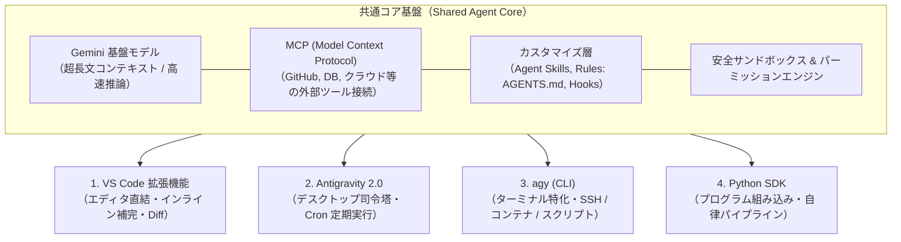
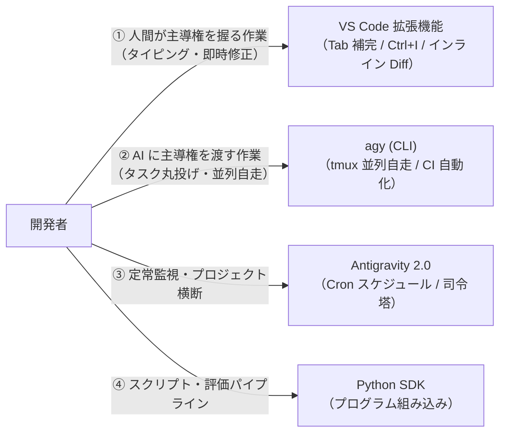

> [!NOTE] 個人用メモ・備忘録
> 日々の開発・インフラ検証の備忘録として残している個人ノートです。手元環境での動作ログをもとにまとめています。環境差異等もあるため、参考にされる場合はご自身の環境で検証の上ご活用ください。

## はじめに

2026 年 8 月 19 日、Google Antigravity の **VS Code 向け公式拡張機能（Antigravity Extension for VS Code）** がリリースされました。

これまでスタンドアロンの AI エディタ（Antigravity IDE）やデスクトップアプリ（Antigravity 2.0）、ターミナル用 CLI（`agy`）で提供されていた自律エージェント機能が、使い慣れた通常の VS Code 環境へ直接アドオンできるようになりました。

「従来の Gemini Code Assist と何が違うのか？」「デスクトップアプリ（Antigravity 2.0）や CLI（`agy`）とはどう使い分ければよいのか？」という疑問を持つ開発者も多いはずです。

本記事では、Gemini Code Assist から Antigravity への進化の背景、共通するエージェントコアのアーキテクチャ、そして **4 つの提供形態（Surfaces: VS Code 拡張機能、Antigravity 2.0、`agy` CLI、Python SDK）の特徴と実務での使い分け** を整理します。

---

## 開発者 AI が直面していた「形態の分断」と進化の必然性

AI を活用したコーディング支援は、インラインのコード補完（Tab）やチャットウィンドウでの対話から始まりました。しかし、開発規模が大きくなるにつれて以下のような構造的課題が顕在化しました。

1. **「提案」止まりによる手動作業のボトルネック**:
   - 従来の Gemini Code Assist や一般的な AI 拡張機能は、コード修正やコマンドをチャット欄で「提案」し、ユーザーが手動でエディタに貼り付け、ターミナルで実行してエラーが出たら再度チャットに貼る、という対話が中心でした。
2. **手動モード切り替え（Ask / Edit / Agent）の煩雑さ**:
   - 「質問だから Ask」「特定行の修正だから Edit」「自動実行させたいから Agent」と、作業ごとに手動で UI モードを切り替える必要がありました。
3. **作業環境によるツールの分断**:
   - GUI エディタ上では便利な補完が効く一方、SSH 先のリモートサーバー、コンテナ内部、あるいは CI/CD スクリプトなどのターミナル環境では同じ AI 支援を利用しにくいという断片化がありました。

```text
【従来の開発スタイル（受動型）】
ユーザーが指示 ➔ AI がコード提案 ➔ ユーザーが手動適用 ➔ ユーザーが手動テスト ➔ エラーを目視確認

【Antigravity の自律ループスタイル（エージェント型）】
ユーザーがゴールを指示 ➔ AI が計画策定 ➔ ファイル自律編集 ➔ テスト・ビルドを自律実行 ➔ エラーを読み取り自己修復
```

Antigravity は、これらの課題を解消し、**「単一のエージェントコアエンジンを、エディタ・デスクトップ・ターミナル・プログラムの 4 つの窓口（Surfaces）から一貫して利用できるプラットフォーム」** として再設計されました。

---

## 共通基盤アーキテクチャ（Shared Agent Core）

Antigravity のすべてのツール（拡張機能、デスクトップ、CLI、SDK）は、独立した別々の製品ではなく、**共通のエージェント基盤** を共有しています。



### 共通コアが提供する 4 大要素

1. **Gemini 基盤モデル**:
   - 巨大なコンテキストウィンドウと高速・低遅延な推論により、リポジトリ全体のコンテキストを把握しながら自律ループを駆動。
2. **Model Context Protocol (MCP)**:
   - Linux Foundation（AAIF）傘下で標準化されたオープン規格に準拠し、GitHub MCP やデータベース接続、カスタムツールを共通で利用可能。
3. **オープンな設定・スキル規格**:
   - プロジェクト固有のルールは `AGENTS.md`、定型タスク手順は `Agent Skills`（`SKILL.md`）、統合パッケージは `Agent Plugins`（`plugin.json`）として全サーフェス共通で読み込み。
4. **安全なサンドボックス & パーミッション**:
   - ターミナルコマンドの実行ポリシー（許可・確認・サンドボックス隔離）を共通ルールで制御。

---

## 提供形態（Surfaces）の比較と特徴

共通コアの上に構築された 4 つのインターフェースは、開発者の作業シーンに応じて最適化されています。

| ツール / サーフェス | インターフェース | 主な役割 | 代表的な利用シーン |
| :--- | :--- | :--- | :--- |
| **VS Code 拡張機能** | GUI エディタ統合 | **エディタ直結ペアプログラマ** | 日常のコーディング、インライン補完（Tab）、選択範囲のピンポイント修正（`Ctrl+I`）、Visual Diff 確認 |
| **Antigravity 2.0** | デスクトップアプリ (Electron) | **エージェント司令塔** | プロジェクト横断管理、定期自動化タスク（Cron）、エディタから独立したチャットキャンバス |
| **`agy` (CLI)** | ターミナル (CUI / TUI) | **ターミナル特化エージェント** | SSH 先サーバー、コンテナ内作業、キーボード完結の高速操作、CI / スクリプト自動化（`-p`） |
| **Python SDK** | Python ライブラリ | **プログラム組み込み** | Python スクリプトからのエージェント呼び出し、自律評価パイプライン、カスタム CLI 開発 |

---

### 1. VS Code 拡張機能（エディタ一体型）

2026 年 8 月 19 日に正式提供が開始された拡張機能です。使い慣れた VS Code の設定、テーマ、拡張機能、Dev Containers 環境をそのまま維持しながら Antigravity を利用できます。

```text
[ VS Code エディタ画面 ]
┌───────────────────────────────┬───────────────────────────────┐
│ 1. エディタ領域               │ 3. サイドバーチャット         │
│  - Antigravity Tab (補完)     │  - Agent Mode (自律実行)      │
│  - Supercomplete (一括差分)   │  - Planning Mode (計画承認)   │
│  - Ctrl+I (インライン編集)    │  - サブエージェント監視       │
│  - インライン Diff 表示       │                               │
├───────────────────────────────┴───────────────────────────────┤
│ 2. 統合ターミナル / Problems 自動修正（1 クリック修復）       │
└───────────────────────────────────────────────────────────────┘
```

#### 主な機能
* **Antigravity Tab / Supercomplete**:
  - カーソル位置での単行補完だけでなく、複数行にわたる一括差分（削除・追加・import の自動挿入）を Tab キー 1 つで適用。
* **Inline Command (`Ctrl+I` / `Cmd+I`)**:
  - 対象コードをハイライトしてショートカットを押し、「この関数に型アノテーションを追加して」とピンポイントで指示。
* **Visual Diff Overlays**:
  - エディタのコード上に直接赤緑のインライン Diff が表示され、変更内容を目視で確認しながら個別に採否を決定可能。
* **Problems 連携**:
  - コンパイラエラーや Linter の警告から「Fix with Agent」を 1 クリックして自動修正。

---

### 2. Antigravity 2.0（デスクトップ司令塔）

IDE（エディタ）の画面とは独立して動作する、スタンドアロンのデスクトップ Electron アプリケーションです。

#### 主な機能
* **プロジェクト横断管理**:
  - 複数のリポジトリやワークスペースを左サイドバーで切り替え、並行してエージェントにタスクを委譲。
* **定期実行タスク（Scheduled Tasks / Cron）**:
  - 「毎朝 9 時に依存関係の脆弱性をスキャンする」「1 時間ごとにビルド状況をチェックする」といった Cron スケジュールを GUI 上で設定・監視。
* **独立したチャットキャンバス**:
  - エディタの表示領域を狭めることなく、大画面でエージェントとの設計議論や `implementation_plan.md` のレビューに専念。

---

### 3. Antigravity CLI (`agy`)（ターミナル特化）

GUI を持たない環境や、ターミナルからキーボード操作のみで爆速で作業したい開発者向けの公式 CUI / TUI ツールです。

#### 主な機能
* **ターミナル完結の対話型 TUI**:
  - ターミナルで `agy` を起動するだけで、スラッシュコマンド（`/help`, `/plan`）や `@` メンションを使った対話が可能。
* **ヘッドレス / リモート環境対応**:
  - GUI が存在しない SSH 先のクラウド VM や、Docker コンテナ内部でもそのまま動作。
* **非対話モード（`-p` / Prompt）による自動化**:
  - `agy -p "Issue #42 の内容を修正してテストを実行"` のように、シェルスクリプトや CI パイプラインからエージェントを直接呼び出してタスクを完遂。

```bash
# 対話型 TUI の起動
agy

# 非対話型でのワンショット実行（CI / スクリプト連携）
agy -p "全ファイルの型チェックを行い、エラーがあれば修正してください"
```

---

### 4. Antigravity Python SDK（プログラム組み込み）

Python コードから直接エージェントを呼び出し、カスタムな自律ワークフローや評価スクリプトを構築するための公式 SDK です（PyPI: `google-antigravity`）。

```python
import asyncio
from google.antigravity import Agent, LocalAgentConfig, CapabilitiesConfig

async def main():
    # ツール実行権限（ファイル編集・コマンド実行）を有効化してエージェントを初期化
    config = LocalAgentConfig(
        system_instructions="あなたはコード品質を検証する専門エージェントです。",
        capabilities=CapabilitiesConfig(),
    )

    async with Agent(config) as agent:
        # 非同期ストリーミングでエージェントと対話
        response = await agent.chat("tests/ 配下のユニットテストを実行して結果を要約して")
        async for token in response:
            print(token, end="", flush=True)
        print()

if __name__ == "__main__":
    asyncio.run(main())
```

#### 主な用途
* テスト自動化パイプラインへの組み込み
* 社内専用のカスタム AI エージェント CLI 開発
* 大規模コードベースに対するバッチリファクタリング スクリプト

---

## 機能差の縮小によって浮き彫りになった「GUI と CLI の真の最適解」

エージェント技術の進化初期、GUI（コード補完や対話チャット）と CLI（ファイル編集・自律ループ）の間には明確な「機能差」が存在し、住み分けは単純でした。

しかし現在、VS Code 拡張機能などの GUI 側も「自律エージェント機能（ツール実行、ファイル編集、MCP 連携）」をフル装備し、カタログスペック上の機能差は大分縮まりました。

「GUI でもエージェントが動くなら、なぜ CLI を使うのか？」── 機能差が埋まったからこそ、**「どちらの環境が、何をするためにアーキテクチャ上最適化されているか（無駄のなさ・コンテキスト純度・並行性）」という本質的な役割分担** が際立つようになりました。

```text
【GUI の最適解：エディタ密着型のローカル知能（Suggestion / In-the-loop）】
・無理にコマンドを手探り実行させるのではなく、
・「開いている画面・カーソル位置・LSP（型情報）」という手元のリッチな文脈を
  100% 活かして、人間の直感的な編集を極上の精度でアシストする。

【CLI の最適解：コマンド駆動型の高純度自律エンジン（Delegation / Out-of-the-loop）】
・「コマンド検索（rg, fd, jq, git）」を最大限に駆使して、必要なコンテキストだけを
  ピンポイントで切り出してノイズ（Attention Dilution）をゼロにする。
・自律トリガー（CI/CD, Cron, バックグラウンド並列）と組み合わせて完全自動化する。
```

---

## なぜバイブコーディングや自律実行では CLI が最適解なのか？

Andrej Karpathy 氏が提唱した「バイブコーディング（大まかな意図だけを伝え、AI に大規模な実装を一気に任せる開発スタイル）」や無人自走において、CLI が決定打となる理由は以下の 3 点にあります。

### 1. 「コマンド検索」によるコンテキスト純度（S/N 比）の極大化
* **GUI の課題（暗黙コンテキストによるノイズ）**:
  GUI の AI は「開いているタブ」などを自動で親切にプロンプトへ詰め込みます。しかし、大規模な改修において無関係なファイルが混ざると、**Attention Dilution（注意の希釈 / Lost in the Middle 現象）** が発生し、指示の見落としやハルシネーションの原因になります。
* **CLI の優位性（高密度コンテキスト）**:
  CLI 環境では、AI 自身（または人間）が `rg` や `fd`、`jq` を使って **「該当する関数の前後 10 行だけ」「特定のエラーログだけ」を外科手術のように切り出してプロンプトに注入** します。ノイズがゼロ（純度 100%）に保たれるため、推論精度が劇的に上がります。

### 2. 「作って終わり」にしない自己検証・修復ループの完走力
バイブコーディングの本質は、大量のコードを一括生成した後の **「テストが通るまでの自走」** です。
CLI 環境の AI は、コード生成直後に自ら `npm run build` や `pytest` を叩き、型エラーやテスト落ちを検知して自律修正するループを何ターンでも裏で完走させます。人間が画面に戻ってきた時には、すでにテストをパスした完成品が出来上がっています。

### 3. マルチプレキシング（5台以上の並列同時自走）
Anthropic の Claude Code 開発チームや最前線のエンジニアが実践している最大の生産性ハックが **「マルチプレキシング（並列化）」** です。
* `git worktree` で作業ツリーを分離し、ターミナル上で **5 台のエージェント（`agy`）を同時に並行自走** させます（Issue 調査、API 実装、テスト追加、ドキュメント更新を同時進行）。
* VS Code で 5 つのウィンドウを開いてエージェントを動かすと、タブが氾濫して画面が崩壊し、メモリ消費で PC が悲鳴を上げます。**「エージェントの群れ（Swarm）を指揮する」には、軽量で画面を奪わないターミナルが唯一の現実解** です。

---

## 提供形態ごとの最終的な役割分担

| 開発のフェーズ・目的 | 要求されるコア技術 | 最適なツール |
| :--- | :--- | :---: |
| **① 大規模自律実行 & バイブコーディング**<br>（機能一括構築、重いリファクタ、無人CI） | ・高密度なコンテキスト収集（`rg`/`jq`）<br>・制限のないシェル実行（Tool Space）<br>・`git worktree` による並列分散自走 | **CLI 版 (`agy`)** |
| **② 人間主導の手元アシスト**<br>（Tab補完、1行修正、型エラー即時修正） | ・エディタ未保存メモリ/LSP への同期<br>・カーソル座標のリアルタイム把握<br>・インライン赤緑 Diff レビュー | **VS Code 拡張機能** |



---

## まとめ

機能差が縮まった現在、それぞれのツールの存在価値は以下のように美しく整理されます。

- **エージェントの「頭脳・自律能力・調査力・完走力」を最大化したいとき（バイブコーディング、重いタスク、自動化）**
  ➔ **CLI 版（`agy`）が機能的・アーキテクチャ的に絶対の最適解**。
- **「人間がエディタでコードを書く作業を、手元で気持ちよくアシストさせたいとき（補完・即時修正）」**
  ➔ **GUI 版（VS Code 拡張機能）が UI として最適**。

状況に応じて最適なインターフェースを選択・併用することで、AI エージェントの自律性を最大限に引き出した開発環境を構築できます。

> ※ 本記事の構成検討・技術仕様の検証・Hugo による静的ビルド検証・推敲は、AI コーディングエージェントとの自律協働ループによって執筆・検証されています。

---

## 参考リンク・情報ソース

- [Google Antigravity Documentation (antigravity.google/docs)](https://antigravity.google/docs)
- [Antigravity CLI Reference (antigravity.google/docs/cli/reference)](https://antigravity.google/docs/cli/reference)
- [Antigravity Python SDK (GitHub: google-antigravity/antigravity-sdk-python)](https://github.com/google-antigravity/antigravity-sdk-python)
- [Model Context Protocol Specification (modelcontextprotocol.io)](https://modelcontextprotocol.io)
- [Agent Skills Runbook Specification (agentskills.io)](https://agentskills.io)
- [Agent Plugins: Open Specification (agent-plugins.org)](https://agent-plugins.org)
- [Lost in the Middle: How Language Models Use Long Contexts (Liu et al., 2023)](https://arxiv.org/abs/2307.03172)

