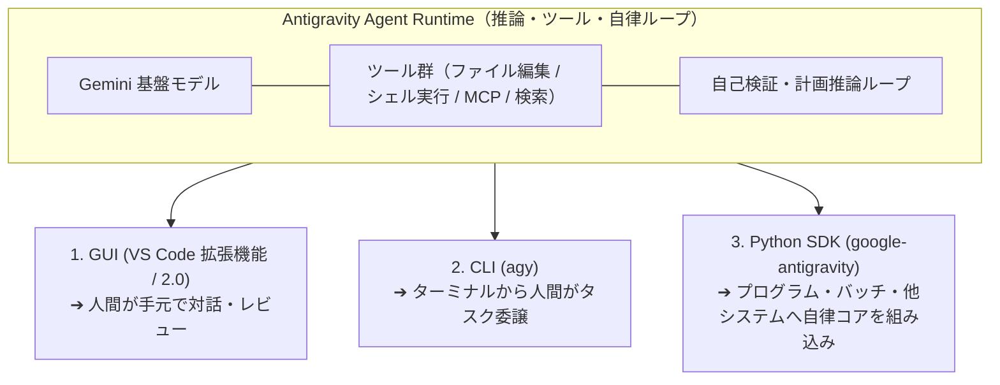
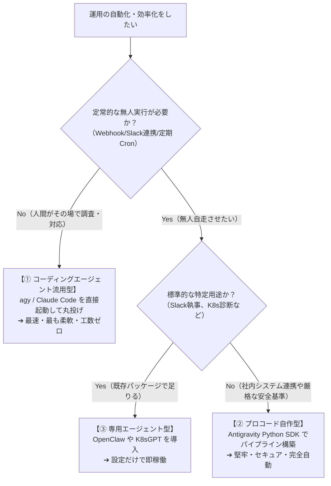

> [!NOTE] 個人用メモ・備忘録
> 日々の開発・インフラ検証の備忘録として残している個人ノートです。手元環境での動作ログをもとにまとめています。環境差異等もあるため、参考にされる場合はご自身の環境で検証の上ご活用ください。

## はじめに

「AI コーディングエージェント（Antigravity、Claude Code、SWE-agent 等）は、エンジニアがアプリケーションのコードを書くためのツールである」──多くの人がこのように捉えています。

しかし、Antigravity が提供するインターフェース群を見渡したとき、ひとつの大きな疑問が浮かびます。

**「VS Code 拡張機能や CLI があるのに、なぜ公式の Python SDK（`google-antigravity`）が提供されているのか？」**

人間がチャット画面やエディタで対話するだけなら、Python ライブラリとしてエージェントを操作する SDK は本来必要ありません。この問いの答えこそが、**AI コーディングエージェントという技術の本質が「単なるプログラミング支援」を遥かに超えた領域にあること** を物語っています。

本記事では、コーディングエージェントが持つ真のアーキテクチャ的本質、Python SDK が存在する必然性、そして SRE・データ分析・セキュリティ監査・リサーチといった「開発用途以外（Non-Coding Ops）」への実務応用パターンを解説します。

---

## なぜ「コーディング」から始まったのか？──閉じたループの必然性

AI エージェント技術が、事務作業や一般的なチャットボットではなく「ソフトウェア開発（Coding）」の領域で最も早く実用レベルに達したのは偶然ではありません。

自律エージェントがタスクを完遂するためには、以下の 3 つの要素が不可欠です。

1. **決定論的なフィードバック環境**:
   - コードを実行した結果、構文エラーやテスト落ちがシェル標準出力・エラー（`stderr`）として明確に返ってくる。
2. **自己修復可能な閉ループ（Closed Loop）**:
   - エラーログを読み取り、原因となったファイルを修正し、再度テストを走らせて合否を機械的に判定できる。
3. **豊富なコンテキスト操作インターフェース**:
   - `ripgrep` や `git` などの UNIX コマンドを通じて、必要な情報だけを外科手術のように探索・収集できる。

```text
【エージェントにとっての「ソフトウェア開発」という領域】
指示 ➔ 探索（rg, fd） ➔ 修正（edit） ➔ 検証（pytest / npm test） ➔ 合否判定 ➔ 完了
   ↑                                                  │
   └─────────────── エラー出力で自律修正 ───────────────┘
```

つまり、「コーディング」はエージェントにとって **最も検証が容易で、自己完結したフィードバックループを回しやすい理想的な実験場（Sandbox）だった** に過ぎません。

エージェントが内部で獲得した「ファイルシステムを探索し、コマンドを実行し、出力を解析し、外部ツール（MCP）を叩き、ゴールに達するまで自律的に試行錯誤する」という能力は、本質的に **あらゆるコンピュータ作業に応用可能な「汎用自律オペレータ」そのもの** です。

---

## Antigravity Python SDK が存在する真の理由

Antigravity には、VS Code 拡張機能、デスクトップアプリ（Antigravity 2.0）、ターミナル CLI（`agy`）のほかに、公式の **Python SDK（`google-antigravity`）** が用意されています。



### 「人間対面（Chat）」から「システム組み込み（Headless Runtime）」への飛躍

GUI や CLI は、すべて「人間のオペレータ」が画面の前に座って指示を与えることを前提としています。

一方、Python SDK は **「エージェントの自律頭脳を、1 つの非同期関数・モジュールとして既存のプログラムや自動化パイプラインに組み込むこと」** を目的としています。

- **Cron / Airflow などのワークフロー**:
  - 定期的に起動し、障害の予兆検知やレポート生成を完全無人で実行。
- **FastAPI / バックエンド API 連携**:
  - ユーザーからの複雑な非構造化リクエストを受け取り、バックグラウンドでエージェントが複数ツールを駆使して調査・集計した結果をレスポンス。
- **CI/CD パイプライン & セキュリティゲート**:
  - プルリクエスト作成時に、コードの文法だけでなく「アーキテクチャ整合性」や「最新 CVE 脆弱性情報」を自律調査して自動コメント。

Python SDK は、エージェントを「開発者のアシスタント」から **「24 時間 365 日稼働する自律デジタルワーカーのエンジン」** へと昇華させるための窓口です。

---

## 開発用途を超えた 5 つの実務ユースケース

「ファイル操作」「シェル実行」「Web 検索」「MCP 外部連携」を組み合わせることで、開発以外の領域において以下のような高度な自動化が実現します。

| 領域 | 従来の課題（静的スクリプトや人間作業） | AI エージェントによる自律解決（Python SDK） |
| :--- | :--- | :--- |
| **① DataOps / レポート生成** | データ形式が変わるたびにスクリプト修正が必要。定性的なインサイト要約は人間が手書き。 | データを読み取り、自ら可視化 Python スクリプトを生成・実行してグラフを出力し、洞察レポートを Markdown 化。 |
| **② SRE / インシデント調査** | アラート発報後、エンジニアが手作業で複数ログやメトリクスを横断調査し初動が遅れる。 | アラートをフックして自律起動。ログ調査、メトリクス照会、原因の特定と暫定復旧コマンドの提案までを自動完遂。 |
| **③ SecOps / コンプライアンス** | 静的ルール（Linter）では文脈や最新のゼロデイ脆弱性（CVE）に対応できない。 | 設定ファイルや IaC を読み、Web 検索で最新の脆弱性データベースと照合して影響範囲を判定・パッチ作成。 |
| **④ Docs as Code / 品質管理** | ドキュメントのリンク切れ、表記揺れ、コード例の動作検証が手動で形骸化。 | ドキュメント内のコードを実際にテスト環境で実行・検証し、壊れたサンプルコードやリンクを自律修正。 |
| **⑤ Research & ファクトチェック** | Web 検索結果を人間が何時間もかけて目視確認・精査・比較表作成。 | Web 検索ツールと MCP を駆使して一次情報ソースを多角的に収集し、ファクトチェック済みの要約を作成。 |

---

### ユースケース詳細

#### 1. DataOps：アドホック分析とビジュアルレポートの完全自動化
従来のデータ分析スクリプトは、想定外のカラム変更や欠損値で即座にエラー停止します。
エージェントは、エラーが発生しても「エラー出力を読み取って Pandas の処理を自己修正し、再実行する」という自律ループを持つため、未知のデータセットに対しても確実にグラフ描画とインサイト抽出を完走させます。

#### 2. SRE / インフラ運用：障害の自律トリアージ
PagerDuty や Datadog のアラート通知をトリガーに Python SDK 経由でエージェントを起動します。エージェントは Kubernetes クラスタやサーバーに接続し、`kubectl logs` や `journalctl` を叩いて直近のエラーログを特定。Prometheus のメトリクスと突合し、「どのデプロイが原因か」を突き止めて Slack に詳細なインシデント初動レポートを投稿します。

---

## Python SDK による実装例：SRE 障害調査エージェント

以下は、Antigravity Python SDK（`google-antigravity`）を用いて、障害ログを自律調査し、サマリーレポートを生成するスクリプトの例です。

```python
import asyncio
import sys
from google.antigravity import Agent, LocalAgentConfig, CapabilitiesConfig

async def investigate_incident(log_dir: str, incident_id: str):
    """
    障害ログディレクトリを自律調査し、原因特定と暫定復旧策をまとめたレポートを出力する
    """
    # ツール実行権限（ファイル読み取り・シェル実行）を安全に構成
    config = LocalAgentConfig(
        system_instructions=(
            "あなたは高度な SRE 診断エージェントです。"
            "提供されたログディレクトリ内のファイルを調査し、エラーログの抽出、"
            "時系列での影響分析、および根本原因の仮説を立てて Markdown レポートを作成してください。"
        ),
        # 安全のため、書き込み権限やコマンド実行を明示的に有効化
        capabilities=CapabilitiesConfig(),
    )

    prompt = f"""
    インシデント ID: {incident_id} の調査を開始してください。
    対象ログパス: {log_dir}
    
    1. rg コマンド等を用いて、直近 1 時間の ERROR / FATAL ログを抽出してください。
    2. エラー発生前後の設定変更や例外スタックトレースを特定してください。
    3. 根本原因の要約と、推奨される暫定対応手順をレポートとしてまとめてください。
    """

    print(f"[*] インシデント {incident_id} の自律調査を開始します...\n")

    async with Agent(config) as agent:
        response = await agent.chat(prompt)

        # エージェントの回答トークンをストリーミング表示
        async for token in response:
            sys.stdout.write(token)
            sys.stdout.flush()
        print("\n\n[*] 調査が完了しました。")

if __name__ == "__main__":
    # 実行例
    asyncio.run(investigate_incident(log_dir="/var/log/app", incident_id="INC-20260823-01"))
```

### エンタープライズ導入における安全設計（Safety by Default）

業務システムや自動化パイプラインにエージェントを組み込む際、最大の懸念となるのは「予期しないコマンド実行やデータ破壊」です。Antigravity Python SDK は以下の多層防御アーキテクチャを備えています。

1. **Read-only デフォルト原則**:
   - `capabilities=CapabilitiesConfig()` を明示的に設定しない限り、ファイル編集やシェル実行は遮断され、探索・読み取り専用で動作します。
2. **サンドボックス隔離**:
   - コマンド実行は隔離されたサンドボックス環境内で行われ、ホスト OS や不要なネットワークアクセスへの影響を防止します。
3. **可観測性（Streaming Thoughts / ToolCalls）**:
   - `response.thoughts`（思考ログ）や `response.tool_calls`（実行されたツール名と引数）をリアルタイムにプログラム側でフック・監査ログに記録できます。

---

## 運用で AI エージェントを活用する 3 つのアプローチと使い分け

実務の運用現場で AI エージェントを活用するアプローチは、大きく以下の **3 つの方式（パターン）** に整理できます。

| 方式 | 概要・代表例 | メリット | デメリット・制約 | 最適な利用シーン |
| :--- | :--- | :--- | :--- | :--- |
| **① コーディングエージェント流用型**<br>（Zero-code Ops） | **`agy` / Claude Code / Cursor** を運用サーバーや端末で直接起動し、自然言語で指示 | **・開発コスト 0（即座に使える）**<br>**・高いアドホック柔軟性**（`kubectl`, `ssh`, `docker`, `jq` 等の全ツールを AI がその場で組み合わせる） | ・無人の定常自動化には向かない（人間が CLI を叩く必要がある）<br>・権限が広すぎるため破壊的コマンドの安全管理が必要 | **アドホックな障害調査、ワンオフのログ解析、環境構築、緊急トラブルシュート** |
| **② プロコード自作型**<br>（SDK / Pipeline 組み込み） | **Antigravity Python SDK** や [LangGraph](https://www.langchain.com/langgraph) 等で、専用の運用スクリプト・サービスを構築 | **・完全無人・イベント駆動（Webhook / Slack）**<br>**・厳格な権限管理 & 監査ログ**（実行可能コマンドをホワイトリスト化） | ・コードの実装・保守コストがかかる<br>・想定外の事態（Ad-hoc）への柔軟性はツールの設計範囲に限定される | **定常監視バッチ、インシデント自動一次トリアージ、CI/CD セキュリティゲート** |
| **③ 専用エージェント型**<br>（Turnkey Agents） | [OpenClaw](https://github.com/openclaw/openclaw) / [K8sGPT](https://k8sgpt.ai/) / [HolmesGPT](https://github.com/robusta-dev/holmesgpt) などの特定用途完成品エージェント | **・UI やチャット連携が完成済み**<br>・特定ドメイン（Slack 連携、K8s 診断等）に特化したチューニング | ・製品の枠組みを超える作業ができない<br>・社内独自システムや特殊なログ形式への適応が難しい | **個人・チームの日常雑務代行（Slack 経由）、標準的な K8s クラスタの診断** |

### なぜ「コーディングエージェントの流用」が最も柔軟で手間がかからないのか？

一見すると「正式な運用ツールではない」ように思えるコーディングエージェント（`agy` や Claude Code）の運用流用ですが、実務上は **柔軟性が高く、立ち上げの手間が不要な即効性のあるアプローチ** となっています。

> [!TIP] なぜコーディングエージェントは運用の即戦力になるのか？
> プロコードでエージェントを自作する場合、「この API を叩く関数」「このログを取得するツール」を人間が 1 つずつ Python で定義してあげる必要があります。  
> 一方、コーディングエージェントは **「すでに完全なシェル実行環境と自己修復ループを持っている」** ため、サーバー上にある `kubectl`、`grep`、`systemctl`、`aws` CLI などを、その場の状況に応じて AI 自身が勝手に組み合わせて目的を達成します。

### 実務での判断基準（Decision Flow）



---

## まとめ

「AI コーディングエージェント」という名称は、この技術の進化の出発点を表しているに過ぎません。

- **エディタの中（GUI / VS Code 拡張機能）**: 人間の直感を研ぎ澄ます「ペアプログラマ」
- **ターミナルの中（CLI / `agy`）**: タスクを丸投げして並行自走させる「自律エンジニア / 運用オペレータ」
- **プログラムの中（Python SDK）**: 業務パイプラインを裏で駆動する「汎用自律オペレータ基盤」

Antigravity に Python SDK が用意されている理由は、**エージェントの推論・実行ループをあらゆる業務自動化の「部品」として解放するため** です。

開発用途という枠組みを外し、手元のトラブルシュートには CLI を、定常的な無人運用には Python SDK や専用エージェントを使い分けることで、次世代の自律運用体制を構築できます。

> ※ 本記事の構成検討・技術仕様の検証・Hugo による静的ビルド検証・推敲は、AI コーディングエージェントとの自律協働ループによって執筆・検証されています。

---

## 参考リンク・情報ソース

- [Google Antigravity Python SDK (GitHub: google-antigravity/antigravity-sdk-python)](https://github.com/google-antigravity/antigravity-sdk-python)
- [Google Antigravity Documentation (antigravity.google/docs)](https://antigravity.google/docs)
- [OpenClaw: Open Source Autonomous Personal Agent (GitHub: openclaw/openclaw)](https://github.com/openclaw/openclaw)
- [K8sGPT: Kubernetes SRE Diagnostics (k8sgpt.ai)](https://k8sgpt.ai/)
- [HolmesGPT: Autonomous SRE & Incident Investigation (GitHub: robusta-dev/holmesgpt)](https://github.com/robusta-dev/holmesgpt)
- [OpenAI: Code Interpreter & Assistants API (platform.openai.com)](https://platform.openai.com/docs/assistants/tools/code-interpreter)
- [Model Context Protocol Specification (modelcontextprotocol.io)](https://modelcontextprotocol.io)
- [SWE-agent: Agent-Computer Interfaces to Solve Real-World GitHub Issues (Yang et al., 2024)](https://swe-agent.com/)
- [Anthropic: Computer Use & Tool-Using Agents](https://docs.anthropic.com/en/docs/build-with-claude/computer-use)

