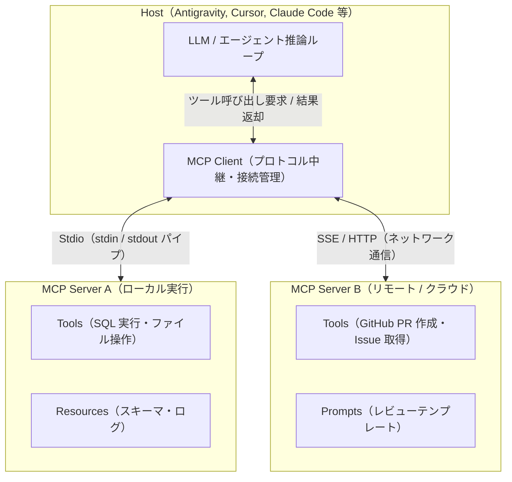

## はじめに

AI コーディングエージェントにデータベースのスキーマを取得させたり、GitHub の Issue や PR を操作させたり、社内 API と連携させる際、以前はエージェント製品ごとに個別の連携コードや独自拡張を書く必要がありました。

この「エージェントと外部ツールの個別結合（1 対 N の断片化）」を解消するために策定されたオープン標準規格が **Model Context Protocol（[MCP](https://modelcontextprotocol.io)）** です。

かつて開発環境において IDE とプログラミング言語の解析エンジンを分離した **Language Server Protocol（LSP）** と同様に、MCP は **「LLM（クライアント）」と「外部データ・ツール（サーバー）」を疎結合な共通プロトコルで接続** します。

本記事では、MCP の誕生背景とオープン標準化（Linux Foundation 移管）の経緯、3 大基本機能（Tools / Resources / Prompts）、通信トランスポート（Stdio / SSE）、安全な設定方法、および TypeScript / Python による自作サーバーの実装設計をまとめます。

---

## MCP の誕生とオープン標準化（AAIF 移管）

MCP は、2024 年 11 月に **Anthropic** によって提唱・オープンソース化されました。

当初から特定ベンダーに縛られないオープン規格として設計されていましたが、2025 年 12 月 9 日、中立なガバナンスのもとで業界標準として普及させるため、Linux Foundation 傘下の **Agentic AI Foundation (AAIF)** へ正式に寄贈・移管されました。

```text
【LSP のアプローチ】
エディタ（VS Code, Neovim 等） <── [ LSP ] ──> 言語サーバー（TypeScript, Go, Rust 等）

【MCP のアプローチ】
エージェント（Antigravity, Claude, Cursor 等） <── [ MCP ] ──> ツール・データサーバー（GitHub, DB, Slack 等）
```

現在では Anthropic 製品に限らず、Google Antigravity、Cursor、Microsoft、OpenAI Codex などの主要なエージェント基盤や、統合パッケージ規格 **Agent Plugins 1.0.0** におけるツール接続のコア仕様として採用されています。

---

## アーキテクチャと通信モデル

MCP は、**Host（親アプリケーション）**、**Client（プロトコル仲介）**、**Server（ツール提供元）** の 3 層アーキテクチャで構成されます。

通信には **JSON-RPC 2.0** を採用しており、標準化されたリクエスト / レスポンスおよび通知メッセージによってやり取りされます。



### 3 つのコンポーネント

1. **Host**:
   - エージェントの実行環境（Antigravity CLI、Cursor、Claude Desktop 等）。ユーザーの指示を受け取り、LLM による推論ループを駆動します。
2. **Client**:
   - Host 内部で動作し、各 MCP サーバーとの 1 対 1 のセッションを管理するモジュール。サーバーの機能一覧（Capabilities）を取得し、LLM からの呼び出し要求を JSON-RPC メッセージに変換して中継します。
3. **Server**:
   - 外部ツールやデータソースを公開する独立した軽量プロセス（またはリモートサービス）。Host から要求されたツール実行やデータ読み込みを行い、結果を返却します。

---

## 通信トランスポート（Stdio と SSE）

MCP クライアントとサーバー間の通信レイヤー（Transport）には、主に 2 つの方式が定義されています。

| トランスポート方式 | 通信経路 | 主なユースケース | 特徴 |
| :--- | :--- | :--- | :--- |
| **Stdio Transport** | 標準入出力（stdin / stdout） | ローカル開発環境、CLI、ローカル DB 操作 | ホストからサブプロセスとして直接起動。ネットワーク不要で高速かつセキュア |
| **SSE Transport** | Server-Sent Events ＋ HTTP POST | クラウドサービス、社内共有 API サーバー | リモートサーバーとの通信に対応。インフラとして常駐稼働させる場合に利用 |

ローカル開発環境（DevContainer やローカル端末）では、設定ファイルにコマンドを記述するだけでオンデマンドに起動・破棄できる **Stdio Transport** が最も一般的に利用されます。

---

## 中核機能（Primitives）の構成

MCP サーバーは、エージェントに対して以下の 3 種類のプリミティブを公開できます。

```text
MCP Server
├── 1. Tools       # エージェントが実行する関数（副作用あり・JSON Schema 検証）
├── 2. Resources   # エージェントが参照するデータ（読み取り専用・URI 形式）
└── 3. Prompts     # 定型プロンプトのテンプレート（スラッシュコマンド・ワークフロー）
```

### 1. Tools（ツール実行）
エージェントが自律的に呼び出す関数（Function Calling）を定義します。
- **特徴**: 引数のバリデーションに **JSON Schema** を使用し、決められた形式でのみ安全に呼び出されます。
- **副作用**: ファイルの書き込み、PR の作成、SQL の実行など、状態変更を伴う操作が含まれます。
- **例**: `create_pull_request`, `query_database`, `execute_search`

### 2. Resources（コンテキストデータ供給）
エージェントがオンデマンドで読み込むための、URI 形式で識別されるデータソースです。
- **特徴**: 読み取り専用（Read-only）。テキストまたはバイナリデータを返します。
- **例**: `file:///var/log/app.log`, `postgres://schema/users`, `docs://api/v1`

### 3. Prompts（対話テンプレート）
サーバー側で事前定義されたプロンプトやコンテキスト注入用テンプレートです。
- **特徴**: エージェントのユーザーインターフェース上でスラッシュコマンド等として提示され、定型的な指示（コードレビュー指示、障害調査テンプレート等）を標準化します。

---

## Rules・Skills・Agent Plugins との役割分担

AI エージェントの拡張アーキテクチャ全体における MCP の位置づけです。

| 規格 / 要素 | 管理ファイル | 役割・定義 | 読み込みタイミング |
| :--- | :--- | :--- | :--- |
| **Rules** | `AGENTS.md` | プロジェクト全体の共通規約・制約・Guardrails | 毎ターン常時ロード |
| **Skills** | `SKILL.md`（[agentskills.io](https://agentskills.io)） | 特定タスクの専門手順書・実行スクリプト | タスク発生時にオンデマンド展開 |
| **MCP** | `mcp_config.json`（[modelcontextprotocol.io](https://modelcontextprotocol.io)） | 外部データ・API 連携の型安全な接続インターフェース | プラグイン起動時に常駐接続 |
| **Plugins** | `plugin.json`（[agentplugins.io](https://agentplugins.io)） | 上記の Rules / Skills / MCP を 1 つに束ねた統合パッケージ | インストール・有効化時に一括管理 |

---

## Agent Skills と比較した MCP の 5 つの固有メリット

「特定タスクの手順を実行する」という目的において、**Agent Skills（`SKILL.md` ＋ `scripts/`）** と **MCP** は一見似ているように見えますが、設計思想と技術的アプローチが根本的に異なります。

| 比較項目 | Agent Skills (`SKILL.md` ＋ スクリプト) | Model Context Protocol (MCP) |
| :--- | :--- | :--- |
| **実行モデル** | エージェントによる **任意のシェルコマンド実行** | Host 仲介による **型定義された RPC 関数呼び出し** |
| **引数・型検証** | プロンプト（自然言語）頼み。構文エラーやインジェクションのリスクあり | **JSON Schema による事前バリデーション**。不正な型・引数を物理遮断 |
| **セキュリティ境界** | ターミナル実行権限が必要（ホスト破壊のリスク） | **ホワイトリストされた API のみ許可**（ターミナル権限不要） |
| **通信・配置** | ローカルファイルシステム上のスクリプトに依存 | **Stdio（ローカル）＋ SSE / HTTP（リモート）** に対応 |
| **接続・状態管理** | コマンド実行ごとにプロセスが起動・終了（ステートレス） | サーバーが常駐し、**DB コネクションプールや認証状態を維持** |
| **データ連携** | 静的なドキュメント読み込み | **Resources による動的データ供給・リアルタイム購読** |

---

### 1. JSON Schema による厳格な型安全性と引数のバリデーション

- **Skills の課題**:
  Skills のスクリプト（Bash/Python）を呼ぶ際、LLM は自然言語の指示からコマンドライン引数を組み立てます。文字列のクォート忘れ、エスケープ漏れ、型の解釈ブレによる実行時エラーや、意図しないコマンドインジェクションが発生するリスクがあります。
- **MCP の優位性**:
  MCP はすべての Tool に **JSON Schema** の定義を強制します。Host（クライアント）が LLM の生成した JSON 引数をスキーマと照合し、**型や必須項目が不正な場合は実行前に自動でエラーを検知・再生成を促す** ため、極めて決定論的で堅牢なツール呼び出しが保証されます。

### 2. ターミナル権限を開放しない「最小権限のセキュリティ」

- **Skills の課題**:
  スクリプトを実行させるには、エージェントに「Bash / ターミナルツールの実行権限」を渡す必要があります。これは、エージェントが誤って他の重要ファイルを操作・削除してしまうリスクを常に内包します。
- **MCP の優位性**:
  エージェントに **ターミナル実行権限を一切与えることなく**、MCP サーバーが公開した「特定の関数（例: `get_issue`, `query_readonly_db`）」のみを選択的に実行させることができます。これにより、最小権限の原則（Principle of Least Privilege）を厳格に適用できます。

### 3. リモート・クラウド接続性と環境非依存のポータビリティ

- **Skills の課題**:
  Skills はローカル環境にスクリプトファイルが存在し、そのスクリプトを実行できるランタイム（Python, Node.js, 各種 CLI ツール等）がホスト OS にインストールされている必要があります。
- **MCP の優位性**:
  MCP は **SSE（Server-Sent Events）や HTTP によるネットワーク越しの通信** を標準サポートしています。ホスト環境にランタイムを追加することなく、クラウド上の SaaS、社内共有のマイクロサービス、コンテナ外の API サーバーと直接接続して操作を委託できます。

### 4. 常駐プロセスによる「コネクションプール・セッションの維持」

- **Skills の課題**:
  スクリプト呼び出しはコマンド実行ごとに新規プロセスが起動して終了するため、データベース接続の確立や OAuth ハンドシェイクを毎回ゼロからやり直す必要があります（オーバーヘッド大）。
- **MCP の優位性**:
  MCP サーバーはセッション中ずっと常駐する独立プロセスとして稼働するため、**DB コネクションプール、メモリキャッシュ、認証セッションを保持** したまま連続したクエリを低レイテンシで高速処理できます。

### 5. 動的なデータ購読（Resources と Live Notifications）

- **Skills の課題**:
  エージェントが `references/` 配下の静的 Markdown をオンデマンドで読むだけの「一方向・受動的」な情報取得に留まります。
- **MCP の優位性**:
  `Resources` プリミティブを通じて、URI ベースで動的にデータを供給できるだけでなく、サーバー側でログやデータが更新された際に **更新通知（`notifications/resources/updated`）をクライアントへリアルタイムにプッシュ** できます。

---

## 各クライアントでの設定とシークレット管理

### 設定ファイルの構造（`mcp_config.json` / `mcp.json`）

MCP サーバーの設定は、JSON 形式で起動コマンドと引数、環境変数を指定します。

```json
{
  "mcpServers": {
    "github": {
      "command": "npx",
      "args": ["-y", "@modelcontextprotocol/server-github"],
      "env": {
        "GITHUB_PERSONAL_ACCESS_TOKEN": "${env:GITHUB_TOKEN}"
      }
    },
    "sqlite-db": {
      "command": "uvx",
      "args": ["mcp-server-sqlite", "--db-path", "./data/app.db"]
    }
  }
}
```

- **`npx -y` / `uvx` によるゼロインストール実行**:
  Node.js 製サーバーは `npx -y <pkg>`、Python 製サーバーは `uvx <pkg>` を指定することで、事前にグローバルインストールすることなくオンデマンドで最新の隔離環境から実行できます。

> [!WARNING]
> **環境変数注入によるシークレット漏洩の防止**
> 設定ファイルを Git でチーム共有したり外部配布する際、API キーやアクセストークンを生の文字列で記述してはなりません。`${env:VAR_NAME}` 形式を用いて、実行環境の環境変数から動的に注入します。

---

## 自作 MCP サーバーの実装例

### 1. TypeScript による実装（公式 SDK）

公式の `@modelcontextprotocol/sdk` を使用した、最小限のツール提供サーバーの実装例です。

```typescript
import { Server } from "@modelcontextprotocol/sdk/server/index.js";
import { StdioServerTransport } from "@modelcontextprotocol/sdk/server/stdio.js";
import {
  CallToolRequestSchema,
  ListToolsRequestSchema,
} from "@modelcontextprotocol/sdk/types.js";

// 1. サーバーインスタンスの生成
const server = new Server(
  {
    name: "metrics-server",
    version: "1.0.0",
  },
  {
    capabilities: {
      tools: {},
    },
  }
);

// 2. 公開するツールの定義（一覧の返却）
server.setRequestHandler(ListToolsRequestSchema, async () => {
  return {
    tools: [
      {
        name: "get_service_metrics",
        description: "指定したサービスのエラー率とレイテンシ（P95）を取得する",
        inputSchema: {
          type: "object",
          properties: {
            serviceName: {
              type: "string",
              description: "対象サービス名（例: auth, payment, api-gateway）",
            },
          },
          required: ["serviceName"],
        },
      },
    ],
  };
});

// 3. ツール実行ハンドラの実装
server.setRequestHandler(CallToolRequestSchema, async (request) => {
  if (request.params.name === "get_service_metrics") {
    const serviceName = String(request.params.arguments?.serviceName);

    // 実際のメトリクス取得処理（例）
    const metricsData = {
      service: serviceName,
      errorRate: "0.02%",
      p95LatencyMs: 124,
      status: "healthy",
    };

    return {
      content: [
        {
          type: "text",
          text: JSON.stringify(metricsData, null, 2),
        },
      ],
    };
  }

  throw new Error(`未定義のツールです: ${request.params.name}`);
});

// 4. Stdio トランスポートで接続待機
const transport = new StdioServerTransport();
await server.connect(transport);
```

### 2. Python による実装（FastMCP）

Python 環境では、公式 SDK 内の `FastMCP` を使用することで、デコレータを用いて極めて簡潔に記述できます。

```python
from mcp.server.fastmcp import FastMCP

# サーバーの初期化
mcp = FastMCP("SystemMetricsServer")

# ツールの定義（型ヒントと docstring が自動的に JSON Schema に変換される）
@mcp.tool()
def get_disk_usage(path: str = "/") -> str:
    """指定されたパスのディスク使用量と空き容量を取得する。
    
    Args:
        path: チェック対象のディレクトリパス
    """
    import shutil
    total, used, free = shutil.disk_usage(path)
    return (
        f"Path: {path}\n"
        f"Total: {total // (2**30)} GB\n"
        f"Used: {used // (2**30)} GB\n"
        f"Free: {free // (2**30)} GB"
    )

if __name__ == "__main__":
    mcp.run()
```

> [!IMPORTANT]
> **`description` と型アノテーションの重要性**
> LLM はツールの `description` と引数のスキーマ定義を読んで「どのツールを呼ぶべきか」「どんな引数を渡すべきか」を判断します。関数の目的、引数の具体例、戻り値のフォーマットを明確に記述することが、ツールの誤発動や引数エラーを防ぐ鍵となります。

---

## セキュリティ設計と運用のベストプラクティス

1. **最小権限の原則（Principle of Least Privilege）**:
   - データベース連携サーバーでは、更新・削除権限（INSERT/UPDATE/DELETE/DROP）を持たない **Read-Only 専用ユーザー** の認証情報を設定する。
2. **物理サンドボックス（ハーネス）との多重防御**:
   - MCP 自体は「安全な API 呼び出し形式」を提供するプロトコルですが、サーバープロセスが動作する環境自体の安全性は Docker コンテナなどの物理サンドボックス（ハーネス）で隔離して担保する。
3. **エラーメッセージの具体化**:
   - ツール実行が失敗した際は、単に例外を握りつぶすのではなく、「なぜ失敗したか（認証切れ、引数不正、対象レコード不在）」をテキストとして明瞭に返却し、エージェントが自己修復ループ内で次の手を判断できるように設計する。

---

## まとめ

- **オープン標準化**: Model Context Protocol（MCP）は Anthropic が提唱後、Linux Foundation 傘下の Agentic AI Foundation（AAIF）に移管された、ベンダーニュートラルなツール接続プロトコル。
- **3 大プリミティブ**: 副作用を伴う **Tools**、コンテキスト供給の **Resources**、対話テンプレートの **Prompts** を JSON-RPC 2.0 で抽象化。
- **エコシステム統合**: 常時ルールの `AGENTS.md`、手順書の `Agent Skills`、統合パッケージの `Agent Plugins` と組み合わせることで、ポータブルで安全なエージェント運用基盤を確立できる。

> ※ 本記事の構成検討・技術仕様の検証・Hugo による静的ビルド検証・推敲は、AI コーディングエージェントとの自律協働ループによって執筆・検証されています。

---

## 参考リンク・情報ソース

- [Model Context Protocol 公式サイト (modelcontextprotocol.io)](https://modelcontextprotocol.io)
- [MCP TypeScript SDK (GitHub)](https://github.com/modelcontextprotocol/typescript-sdk)
- [MCP Python SDK (GitHub)](https://github.com/modelcontextprotocol/python-sdk)
- [Agentic AI Foundation (Linux Foundation)](https://www.linuxfoundation.org)
- [Agent Plugins: The Open Packaging Standard (agent-plugins.org)](https://agent-plugins.org)
