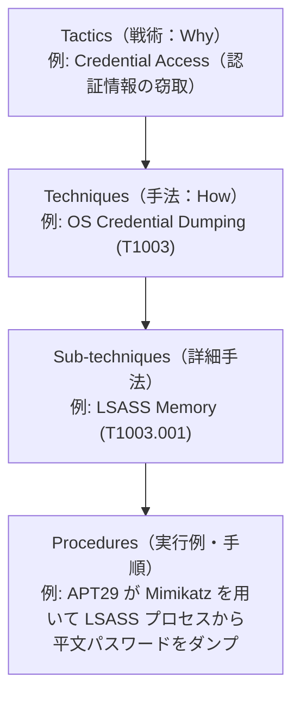

> [!NOTE] 個人用メモ・備忘録
> 日々の開発・インフラ検証の備忘録として残している個人ノートです。手元環境での動作ログをもとにまとめています。環境差異等もあるため、参考にされる場合はご自身の環境で検証の上ご活用ください。

## はじめに

今日のサイバーセキュリティ業界において、脅威分析、EDR の検知ルール作成、レッドチーム演習の共通基盤として使われているのが **MITRE ATT&CK（マイター・アタック）** です。

しかし、なぜ世界中のセキュリティ機関や企業がこの巨大なマトリクスを参照するようになったのでしょうか？

その背景には、かつてセキュリティ業界が信じていた **「境界防御とブラックリストの完全な敗北」** と、そこから生まれた **「発想のコペルニクス的転回」** という歴史的なパラダイムシフトがありました。

本記事では、MITRE ATT&CK が誕生した歴史的背景、David Bianco 氏の「痛みのピラミッド」、TTPs（戦術・手法・手順）の構造、そして防御技術の体系化（D3FEND）に至る進化の軌跡を整理します。

---

## 境界防御の限界と「痛みのピラミッド」

2000 年代から 2010 年代初頭にかけて、企業のサイバーセキュリティは **「境界防御（Perimeter Defense）」** と **「シグネチャ・ブラックリスト」** が中心でした。

- 社内ネットワークの出入り口にファイアウォールや IDS/IPS を設置し、侵入を水際でブロックする。
- 既知のマルウェアのハッシュ値（MD5, SHA-256）や悪意ある IP アドレス・ドメイン名（IOC: Indicators of Compromise）を登録し、合致した通信を遮断する。

```text
[ インターネット ] ──(攻撃)──> [ ファイアウォール (境界) ] ──(遮断)──> [ 社内ネットワーク ]
                                       │
                               【すり抜けた場合、内部は無防備】
```

### なぜブラックリスト方式は破綻したのか？

攻撃者（APT 攻撃グループ等）の技術が進化するにつれ、このアプローチは構造的な限界に直面しました。

攻撃者はマルウェアのコードを 1 バイト書き換えるだけでハッシュ値を無効化でき、クラウドや動的 DNS を使って 1 秒で新しい IP アドレスやドメインを取得できたためです。防御側がどれほど多額の投資をしてブラックリストを更新しても、攻撃者はノーコストですり抜けていきました。

### 痛みのピラミッド（The Pyramid of Pain）

この絶望的な非対称性を 2013 年に見事に言語化したのが、セキュリティ研究者の **David J. Bianco 氏** による **『Pyramid of Pain（痛みのピラミッド）』** です。

```text
               ▲
              / \
             /   \     TTPs（攻撃者の行動パターン・戦術）    【極めて痛い (Tough!)】
            / TTP \
           /-------\
          /  Tools  \   Tools（攻撃ツール・Mimikatz, Cobalt Strike 等）
         /-----------\
        /   Network   \  Network / Host Artifacts（C2通信の痕跡、URI パターン）
       /---------------\
      /  Domain Names   \ Domain Names（悪意あるドメイン名）
     /-------------------\
    /    IP Addresses     \ IP Addresses（攻撃元 IP アドレス）
   /-----------------------\
  /       Hash Values       \ Hash Values（SHA-256, MD5 ハッシュ） 【全く痛くない (Trivial)】
 /---------------------------\
```

ピラミッドの下層にある要素ほど、防御側がブロックしても攻撃者は簡単に変更できます（Trivial / Easy）。
逆に、ピラミッドの頂点にある **「TTPs（Tactics, Techniques, and Procedures：攻撃者の行動パターン）」** を封じられると、攻撃者は攻撃手順やツールの再設計、工作員の再訓練を強いられ、**最も大きな打撃（Tough!）** を受けます。

ここから、**「侵入を 100% 防ぐことは不可能である（Assume Breach: 侵入前提）」** という新たな共通認識が生まれました。

---

## MITRE ATT&CK の誕生：道具ではなく「行動」を追え

2013 年、米国の非営利研究機関 **MITRE（マイター）** は、自組織の研究プロジェクト（FMX: Fort Meade Experiment）の中で、実世界の標的型攻撃データを分析していました。

研究者たちは、従来の IOC（IP やハッシュ）追跡から脱却し、次のような根本的な問いを立てました。

> *「攻撃者はマルウェアや IP をいくらでも変えられる。しかし、侵入した後に『管理者パスワードを抜き取る』『社内ネットワークを探索する』『別の重要サーバーへ横展開する』という **“目的達成のための行動パターン（手口）”** だけは、OS の仕組みや人間の習性上、そう簡単には変えられないのではないか？」*

こうして、実世界の攻撃者が侵入後に実行するすべての手口を網羅・体系化したカタログ、**`MITRE ATT&CK`（Adversarial Tactics, Techniques, and Common Knowledge）** が誕生しました。

```text
【従来の着眼点】
「どんなマルウェアファイル（道具）が使われたか？」（ハッシュ値、ファイル名）

【MITRE ATT&CK の着眼点】
「攻撃者は何を目的として、OS のどの機能をどう悪用したか（行動）？」（プロセスインジェクション、LSASS メモリダンプ等）
```

---

## ATT&CK の基本構造とマトリクス設計

ATT&CK は、攻撃者の行動を **「Tactics（戦術：目的）」** と **「Techniques（手法：手段）」** の 2 軸マトリクスで表現します。



### TTPs の 4 階層モデル

| 階層 | 意味 | 問い | 具体例 |
| :--- | :--- | :--- | :--- |
| **Tactics（戦術）** | 攻撃者の目的 | 何を達成したいのか？ | 初期侵入（Initial Access）、権限昇格（Privilege Escalation）、横展開（Lateral Movement） |
| **Techniques（手法）** | 目的達成の手段 | どのように実行するのか？ | OS Credential Dumping（T1003）、Process Injection（T1055） |
| **Sub-techniques** | 手法のより詳細な分類 | 具体的にどの機能を使うのか？ | LSASS Memory（T1003.001）、NTDS（T1003.003） |
| **Procedures（手順・実例）** | 実際の攻撃グループの記録 | 誰が実際にどう悪用したのか？ | APT28 が特定のコマンドライン引数で `rundll32.exe` を実行 |

---

## 対象ドメインの分類（Enterprise・Mobile・ICS）

ATT&CK は、IT インフラの多様化に合わせて 3 つのドメインに拡張されています。

| ドメイン | 対象環境 | 主な特徴 |
| :--- | :--- | :--- |
| **Enterprise** | Windows, Linux, macOS, AWS, Azure, GCP, Active Directory, Office 365 | 企業システム全般。クラウド環境や SaaS に対するアイデンティティ攻撃も網羅 |
| **Mobile** | Android, iOS | モバイル端末特有のサンドボックス回避、不正プロファイル、通信傍受 |
| **ICS** | SCADA, PLC, 産業制御システム, 発電所・工場 | 物理機器の制御停止、セーフティシステムの無効化などプラント特有の破壊手口 |

---

## 防御側のマッピング情報と活用モデル

ATT&CK が真に画期的だったのは、**「攻撃のカタログ」でありながら、すべてのマス目に「防御情報」が 1 対 1 で紐づいている点** です。

```text
Technique: OS Credential Dumping (T1003.001 - LSASS Memory)
├── Data Sources: Process Access (Sysmon Event ID 10), Command Execution
├── Detection: lsass.exe に対する PROCESS_VM_READ 権限のオープンを監視
└── Mitigations: LSA Protection (RunAsPPL) の有効化、Credential Guard の導入
```

- **Data Sources（データソース）**: その手口を検知するために、どのログ（プロセス生成、レジストリ変更、ネットワーク接続等）を収集すべきか。
- **Detection（検知ロジック）**: SIEM や EDR でどのような相関ルールやシグネチャを組むべきか。
- **Mitigations（予防策）**: 設定変更やアーキテクチャ見直しによって、その手法を根本的に無効化できるか。

---

## 防御側の逆転：死角の可視化から D3FEND へ

ATT&CK という「共通言語（共通の物差し）」を手に入れたことで、防御側の運用は劇的に進化しました。

### 1. カバレッジの可視化とスコアリング（DeTT&CT）

- **ATT&CK Navigator**: ブラウザ上でマトリクスを表示し、自社が検知できるマス（緑）と検知できないマス（赤）をヒートマップで可視化。
- **DeTT&CT ([github.com/rabobank-cdc/DeTT&CT](https://github.com/rabobank-cdc/DeTT&CT))**: 収集ログの品質と検知ルールの有効性を評価し、**「自社の防御体制における死角（ブラインドスポット）」** を客観的データとしてスコアリング。

### 2. 防御技術のオントロジー「MITRE D3FEND」

攻撃者の手口（ATT&CK）が体系化されたのを受け、MITRE は 2021 年、米国 NSA の支援のもと **`MITRE D3FEND` ([d3fend.mitre.org](https://d3fend.mitre.org))** を公開しました。

- **ATT&CK が「攻撃側の手口」** であるのに対し、**D3FEND は「防御側の対抗技術」**（ファイル整合性監視、プロセスメモリ暗号化、セッション無効化等）を精密に定義・マッピングしたオントロジーです。
- これにより、「どの攻撃手法（ATT&CK）に対して、どの防御技術（D3FEND）を配置すれば最も効率的に防御網を築けるか」を論理的に設計できるようになりました。

---

## まとめ

- **境界防御の破綻**: ハッシュ値や IP を追う IOC 追跡は、攻撃者にとって痛くない（痛みのピラミッド）。
- **行動（TTPs）への着眼**: 攻撃者が簡単に変更できない「侵入後の行動パターン」を捉えることで、防御側の優位性を確立。
- **共通言語としての ATT&CK**: 「Tactics（目的）× Techniques（手口）」のマトリクスにより、セキュリティの死角を定量的に可視化。
- **D3FEND への発展**: 攻撃の周期表から防御技術のオントロジーへと進化し、論理的な防御アーキテクチャ設計が可能に。

> ※ 本記事の構成検討・技術仕様の検証・Hugo による静的ビルド検証・推敲は、AI コーディングエージェントとの自律協働ループによって執筆・検証されています。

---

## 参考リンク・情報ソース

- [MITRE ATT&CK 公式サイト (attack.mitre.org)](https://attack.mitre.org)
- [MITRE D3FEND: A Knowledge Graph of Cybersecurity Countermeasures (d3fend.mitre.org)](https://d3fend.mitre.org)
- [The Pyramid of Pain (David J. Bianco, 2013)](https://detect-respond.blogspot.com/2013/03/the-pyramid-of-pain.html)
- [DeTT&CT: Detect Tactics, Techniques & Combat Threats (GitHub)](https://github.com/rabobank-cdc/DeTT&CT)
- [MITRE ATT&CK Navigator (GitHub)](https://github.com/mitre-attack/attack-navigator)
